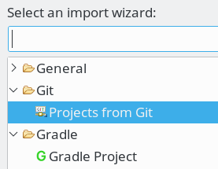
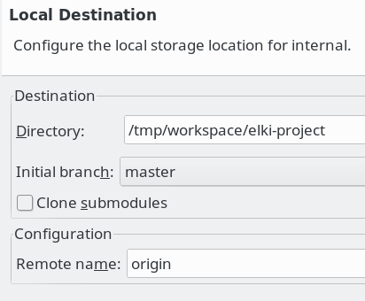
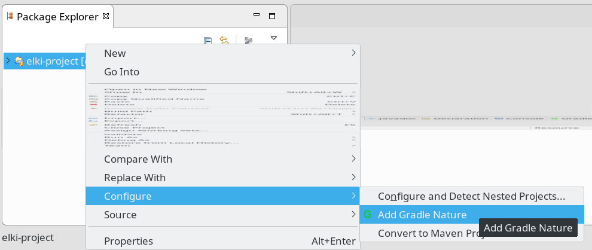
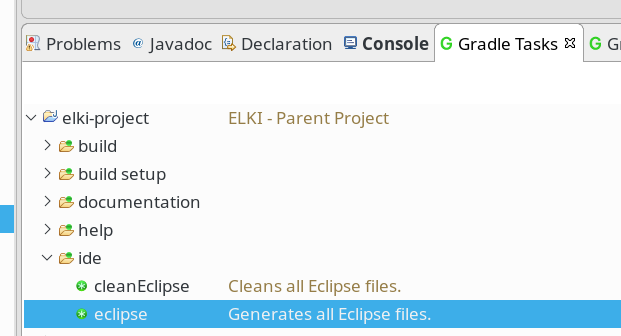
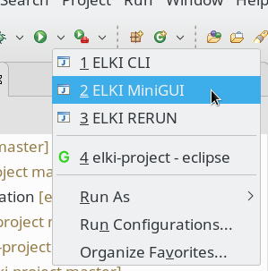

Eclipse Configuration for ELKI
==============================

Eclipse is the main development environment for ELKI, and thus the best supported.

1. Install a recent version of [Eclipse](http://eclipse.org/downloads/), please use version Mars or later.
2. On [GitHub](https://github.com/elki-project/elki) either "fork" the project (to have your personal writable copy) or get the [read-only clone uri](https://github.com/elki-project/elki.git)
3. In Eclipse, Import from Git, Clone URI.

   
   {:style="max-width:277px"}

   Choose a destination folder - we usually do keep this in the Eclipse workspace folder rather than the Eclipse suggestion. Import as "general project".

   
   {:style="max-width:412px"}

4. Right-Click the project, and choose "Configure", "Add Gradle nature". You should see many more projects appear.

   
   {:style="max-width:990px"}

5. In "Gradle Tasks", choose "elki-project, ide, eclipse".

   
   {:style="max-width:621px"}

   (If you do not have the "Gradle Tasks", you can open it via "Window, Show View, Other ...")

6. Right-Click the "elki-project", Refresh (F5). Eclipse will now build ELKI, and the red markers should disappear.

7. You can now run the ELKI MiniGUI:

   
   {:style="max-width:299px"}

