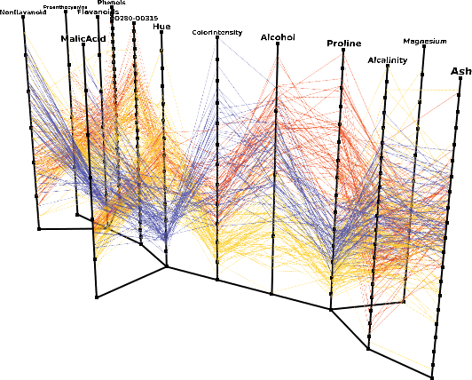

# 3D Parallel Coordinates

This page provides more information on the publication:

 Elke Achtert, Hans-Peter Kriegel, Erich Schubert, Arthur Zimek:  

 **Interactive Data Mining with 3D-Parallel-Coordinate-Trees**.  

 Proceedings of the ACM International Conference on Management of Data (SIGMOD), New York City, NY, 2013.  

 
## Requirements

* ELKI 0.6.0 beta 1, on the [Releases](/releases) page. You need the `elki.jar` file.

* You **need** a PC with a reasonable OpenGL graphics card and working drivers. With Intel graphics, manually upgrade to the latest drivers from Intel, unfortunately many manufacturers do not provide the latest version.

* JOGL2, [Download folder](http://jogamp.org/deployment/jogamp-current/archive/). From the `jogamp-all-platforms.7z` file, get the following jars: `jogl-all.jar`, `gluegen.jar`, `gluegen-rt.jar` and the `-natives` for your platform.

  Debian and Ubuntu users can conveniently install JOGL by: `aptitude install libjogl2-java`

* 3DPC add-on package [3dpc.jar](/releases/3dpc-addon-0.6.0~beta1/3dpc.jar) (includes source code, and windows start script).

## Running

For Debian/Ubuntu Linux users (our primary development platform), the command to run 3DPC is simply:


java -cp 3dpc.jar:elki.jar:/usr/share/java/jogl2.jar \
de.lmu.ifi.dbs.elki.application.ELKILauncher


this will bring up the regular ELKI MiniGUI, with an additional `-resulthandler`.

On Windows, things are a bit trickier, because you need to assemble the correct classpath.
Assuming that you got all the `.jar` files in one directory, write a `3dpc.cmd` file such as this (make sure that it has the correct path to your Java 7 installation):


SETLOCAL enabledelayedexpansion
CP=
FOR %%F IN (*.jar) DO (
  SET CP=!CP!;%%F%
)
REM Make sure this is the path to your Java 7 installation!
"C:\INSERT\YOUR\PATH\TO\Java\bin\java" -Xmx1G ^
 -cp "%CP%" ^
 de.lmu.ifi.dbs.elki.application.ELKILauncher



A more complicated version (trying harder to auto-detect the Java location) of this file is included in the `3dpc.jar` file. Please understand that we cannot provide you assistance with Windows installation issues.

On OSX, you will also need to install Java 7 and JOGL, and the command line should be similar to Linux:


java -cp 3dpc.jar:elki.jar:jogl/lib/*.jar \
de.lmu.ifi.dbs.elki.application.ELKILauncher



## Example use

In this example, we will use the well known [attachment:wines.dat Wine] data set. For details on the data set, visit [Wine data set at UCI ML repository](http://archive.ics.uci.edu/ml/datasets/Wine). Compared to the UCI version, we have added column names to the file, and converted the class label column to text (so it is not mistaken for a numeric attribute).

In the MiniGUI, we set the following parameters:

```
-dbc.in wine.data
-algorithm NullAlgorithm
-resulthandler de.lmu.ifi.dbs.elki.visualization.parallel3d.OpenGL3DParallelCoordinates
-parallel3d.layout CompactCircularMSTLayout3DPC
```

The first specifies the input file. The second will side-step the analysis and visualize only (an automatic by-label clustering will be run instead). The third then chooses the 3DPC visualization, while the fourth choses a slightly more compact axis arrangement. You should see a result such as this:



## Known issues

This is a prototype, so it will not be able to scale up to arbitrary data set sizes and dimensionality. You can rotate the scene, but you cannot yet pan the camera (this is fairly easy to add, and patches are welcome!)

Data support: the current version only supports numerical data, with no missing values. As of now, you should clean your data beforehand, and load 'only numerical columns and a single non-numerical class label'. Again, patches for supporting additional and more flexible data types are welcome.

Intel core integrated graphics: if you get a crash in `ig4dev32.dll`, you should first try upgrade your graphics driver. If your computer manufacturer does not provide an update, you may want to try the driver from Intel (as the graphics are integrated in the CPU, the driver 'should' just work - [search for installation instructions](https://duckduckgo.com/html?q=forcibly%20upgrade%20intel%20graphics%20driver)). Obviously upgrading your driver is at your own risk, as is any use of 3DPC.
