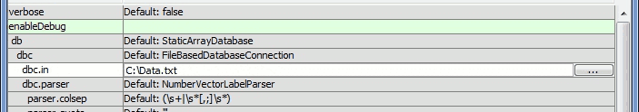
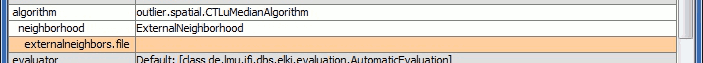

Running ELKI with a command line batch file for spatial outlier detection with an external neighborhood file and saving results
===============================================================================================================================

Contributed by: Boleslo E. Romero, 2/22/2014

Overview
--------

Particular issues are discussed related to running spatial outlier detection processes that employ external neighborhood files. External neighborhoods are first introduced. To provide an example, behavior of the ELKI MiniGUI is briefly covered before specifying the algorithm and source files. Formats of the source files and relevant parameters are then discussed. Finally, saving results and converting the MiniGUI code to a command line batch file are described.

Exernal neighborhoods
---------------------

This example is to describe a way to use a few ELKI algorithm parameters that involve a database connection and an external file listing the nearest neighbors of each database entry. In this case, both the method of specifying a spatial neighborhood and the identification of nearest neighbors is performed outside of the ELKI environment. For instance, with a two-dimensional raster grid commonly used for spatial data, one could perform a routine externally to identify each of the four (adjacent), eight (adjacent and diagonal), or "k" (any number of) nearest neighbors for each raster cell. Any other appropriate method of identifying any "k" (number) of nearest neighbors may be used, but that analysis is outside the scope of this example. Basically, this example describes considerations regarding the format of the database and an external file containing a nearest neighbor list. Using the MiniGUI to create a Windows batch script is also covered.

MiniGUI and parameterized arguments
------------------------------------------------

Once downloaded, the "elki.jar" file can be executed to run the ELKI MiniGUI, assuming the required version of Java is installed on the operating system. For Windows, double-clicking the file in Windows Explorer should run the program. The MiniGUI (Figure 1) allows for interactive selection of "paramaterized" ELKI processes and algorithms, which automatically populate within the MiniGUI, providing additional fields for required parameters. Though a button on the MiniGUI can directly run a fully-specified algorithmic process, the MiniGUI also automatically creates code which is helpful for alternatively running the process from a command line. The MiniGUI also assesses parameter values and provides warnings in red font when parameters are missing.

Specifying the algorithm, type of neighborhood, and files to use
----------------------------------------------------------------

To start this example, the `-dbc.in` parameter is first specified to supply an input database connection. An external file named "`C:\Data.txt`" was selected (Figure 2).

This is the data upon which an algorithm is run. The format of the data will be addressed later, as it was structured externally, outside of ELKI, for use with a particular algorithm. For this example, a spatial outlier detection algorithm is selected, the `CTLuMedianAlgorithm` (Figure 3).

This selection adds a new `-neighborhood` parameter that needs to be specified. Several neighborhood types are allowed for this algorithm (Figure 4).

Since using an external file of neighbors is the main interest here, the `ExternalNeighborhood` is selected, which adds a new parameter, `-externalneighbors.file` (Figure 5).

To specify an external file containing the list of neighbors for each database record, a file named "`C:\Neighbors.txt`" was selected (Figure 6).

Though the MiniGUI code section has no red font, suggesting all the parameters have been specified, there are still considerations with regard to data format and appropriate values for other parameters to read the data.

Format of input database
------------------------

The input database format in this example is based upon a two-dimensional raster grid model. Instead of using row and column indices, each raster cell is given a unique name. This would also work for data formatted as as irregular polygons or named points, as long as unique labels are used for each record in the database. Since ELKI recognizes types of data, it is helpful to provide a name label that includes characters of text. Raster cells could be labeled "cell1", "cell2, ... "celln", for "n" number of cells. In this example of a raster grid with 3 rows and 3 columns of cells, the raster cells are labeled from "cell1" to "cell9" from left-to-right, and top-to-bottom. Inside "C:.txt", the data are organized as one record per line, providing the attribute value followed by the unique cell label separated with a white space, as shown below. Notice that headers are not included, the cell label does not have spaces, and scientific notation is allowed in ELKI.

<pre>
    1.47666834294678e-318 cell1
    1.08819532990558e-158 cell2
    1.47666834294678e-318 cell3
    1.08819532990576e-158 cell4
    80.1920527856548 cell5
    1.08819532990558e-158 cell6
    1.47666834294678e-318 cell7
    1.08819532990576e-158 cell8
    1.47666834294678e-318 cell9
</pre>

Format of external neighborhood file
------------------------------------

The file containing the list of neighbors of each database record includes one line per record, which provide the label for a record followed by all of the labels of the neighbors separated by white spaces, as shown below. Again, headers are not included.

<pre>
    cell1 cell2 cell4 cell5
    cell2 cell1 cell3 cell4 cell5 cell6
    cell3 cell2 cell5 cell6
    cell4 cell1 cell2 cell5 cell7 cell8
    cell5 cell1 cell2 cell3 cell4 cell6 cell7 cell8 cell9
    cell6 cell2 cell3 cell5 cell8 cell9
    cell7 cell4 cell5 cell8
    cell8 cell4 cell5 cell6 cell7 cell9
    cell9 cell5 cell6 cell8
</pre>

Matching records in separate files
----------------------------------

Notice that the first label on each line of the neighbors file, identifying a database record, is required to match the list of neighbors to a record in the database file. For example, "cell2" is the top-center cell in the 3 cell by 3 cell raster grid. Although it could be on any line, it is recorded in the second line of the database file with the label "cell2" following the attribute value. The second line of the neighbors file, which again could be on any line, begins with "cell2", then lists each of that cell's adjacent and diagonal neighbors: "cell1" "cell3" "cell4" "cell5" and "cell6". The "cell2" label was required in each file to identify the neighbors of that cell for use with the spatial outlier algorithm.

Parameters used for matching
----------------------------

For ELKI to read both the database file and the external neighbors file and make appropriate matches between each record, two parameters need to be set accordingly. First, the `-dbc.filter` parameter provides numerous filters used for reading the database records in various ways (Figure 7).

The `ExternalIDFilter` is used in this example for finding a value in each database record to be used as a unique identifier (Figure 8).

Specifying the `ExternalIDFilter` adds to the MiniGUI the `-dbc.externalIdIndex` parameter, which is required for specifying which value of each record in the external file is used for matching to the database record. Since ELKI uses zero-based indices for the `ExternalIDFilter`, the `-dbc.externalIdIndex` it is set to "0" (Figure 9), corresponding to the first value on each line of the external file.

For this example, because the second database record values on each line include characters, they are identified as labels with the `ExternalIDFilter`, such as "cell2" in the database. The `-dbc.externalIdIndex` specifies the first value of each record of the external neighbors file to be used in matching database records to the external neighbor records. With these two parameters set according to the database and external neighbors file formats, the process is ready to run, though a few more steps are worth considering.

Saving results to a directory
-----------------------------

In order to save results to files, it is helpful to use set `-resulthandler` parameter. The default value, "`Default: de.lmu.ifi.dbs.elki.visualization.gui.ResultVisualizer`", is used to review the results interactively (Figure 10).

In this example, interactive review is not necessary so this value is removed. Various options are available for handling results in ELKI (Figure 11).

To save files related to both process settings and results, this example uses the "ResultWriter" value, which adds a new "out" parameter for specifying an particular output directory (Figure 12).

For this example, the directory "C:" is specified (Figure 13). If the folder does not yet exist, it will be created. If any results are already contained in the directory, they may be overwritten.

Creating and running command line batch file
--------------------------------------------

Finally, the code in the MiniGUI is helpful for running the process on a command line. For Windows, a batch file script (`*.bat`) can be created to run the process from the command line manually or automatically through some other script. Most of the code of the MiniGUI can be copied into a file with a text editor. For this example, a new file "`C:\RunELKI.bat`" was first created. Then the code from the MiniGUI was copied into the file. A few alterations were necessary. Some prepending text, "Parameters: ", is first removed. Replacing that text at the start of the line, commands to execute the `elki.jar` file with java are added as `java -jar elki.jar KDDCLIApplication`. It is assumed `elki.jar` is in the same directory. If the `elki.jar` is somewhere else, a path can be included. One last alteration is to enclose each directory and file path with quotes. Here are the contents of the `RunELKI.bat` file for this example:


java -jar elki.jar KDDCLIApplication -dbc.in "C:\Data.txt" ^
-dbc.filter ExternalIDFilter -dbc.externalIdIndex 0 ^
-algorithm outlier.spatial.CTLuMedianAlgorithm ^
-neighborhood ExternalNeighborhood ^
-externalneighbors.file "C:\Neighbors.txt" ^
-resulthandler ResultWriter -out "C:\Results"


In Windows, a batch script file can be run with the command line utility `cmd.exe`. To run the `RunELKI.bat` script manually from the same directory, type the file name of the script file, `RunELKI.bat` without quotes, and press "Enter".
