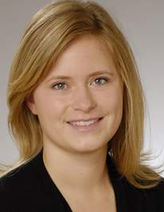

The ELKI Team
=============

Core development and maintenance
--------------------------------

The core team for development and maintenance of ELKI is consisting of:

<table width="100%">
  <tr>
    <td align="center"></td>
    <td align="center"></td>
  </tr>
  <tr>
    <td align="center"><a href="http://dbs.ifi.uni-heidelberg.de/index.php?id=eschubert">Erich Schubert</a> Heidelberg University</td>
    <td align="center"><a href="http://www.imada.sdu.dk/~zimek">Arthur Zimek</a> University of Southern Denmark</td>
  </tr>
</table>

You can contact the core developers by e-mail: elki () dbs ifi lmu de

Contributors
------------

Over the years, many students and colleagues contributed to ELKI.\\
Perhaps you will be among this herd of elks soon?

<ul id="herd">
<li></li>
<li></li>
<li></li>
<li></li>
<li></li>
<li></li>
<li></li>
<li></li>
<li></li>
<li></li>
<li></li>
<li></li>
<li></li>
<li></li>
<li></li>
<li></li>
<li></li>
<li></li>
<li></li>
<li></li>
<li></li>
<li></li>
<li></li>
<li></li>
<li></li>
<li></li>
<li></li>
<li></li>
<li></li>
<li></li>
<li></li>
<li></li>
<li></li>
<li></li>
<li></li>
<li></li>
<li></li>
<li></li>
<li></li>
<li></li>
<li></li>
<li></li>
<li></li>
<li></li>
<li></li>
<li></li>
<li></li>
<li></li>
<li></li>
<li></li>
<li></li>
<li></li>
<li></li>
<li></li>
<li></li>
<li></li>
</ul>

<h3>ELKI contributors</h3>

