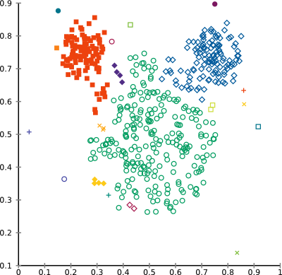
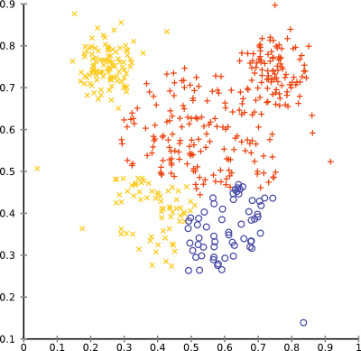
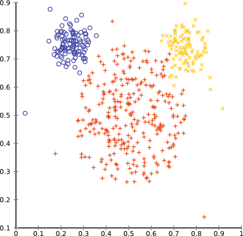
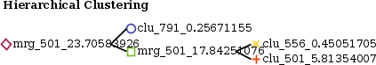
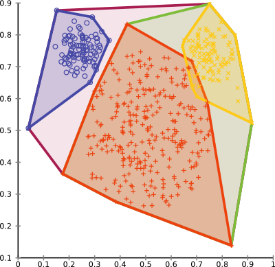

Implementing Hierarchical Clustering
====================================

Version information: Updated for ELKI 0.6.0
{: class="compact" style="font-size: x-small; text-align:right" }

In this tutorial, we will implement the *naive approach* to hierarchical clustering. It is naive in the sense that it is a fairly general procedure, which unfortunately operates in O(n3) runtime and O(n2) memory, so it does not scale very well. For some linkage criteria, there exist optimized algorithms such as [SLINK](/releases/current/doc/de/lmu/ifi/dbs/elki/algorithm/clustering/SLINK.html), which computes single-link clustering in low O(n2) runtime and O(n) memory.

We will initially construct a very simple algorithm, then improve on it in multiple steps. This material was prepared for the tutorials to the KDD lecture at LMU.

Initial Version
---------------

The first version will try to do a straightforward implementation, for single-link only, as a student would likely implement it given a textbook description of the algorithm:

1.  Compute a distance matrix
2.  Repeat until only one cluster remains:
3.  Find minimum in matrix (except diagonal)
4.  Merge these two clusters
5.  Update matrix with minimum of the two columns

However, we will see that there is more to the algorithm, such as the need to track the actual clusters and represent the clustering hierarchy.

### Auto-generated code

First of all, we start a new class, `NaiveAgglomerativeHierarchicalClustering`, extending [AbstractDistanceBasedAlgorithm](/releases/current/doc/de/lmu/ifi/dbs/elki/algorithm/AbstractDistanceBasedAlgorithm.html). For the generics, we restrict the distance type `D` to `NumberDistance<D, ?>` (we can't use non-numerical distances in linkage clustering), and the output type to the abstract type `Result` (for the initial version, we could have used `Clustering<Model>`, too). After having eclipse auto-generate method stubs and constructor, the template code looks like this:


    package tutorial.clustering;

    import de.lmu.ifi.dbs.elki.algorithm.AbstractDistanceBasedAlgorithm;
    import de.lmu.ifi.dbs.elki.data.type.TypeInformation;
    import de.lmu.ifi.dbs.elki.distance.distancefunction.DistanceFunction;
    import de.lmu.ifi.dbs.elki.distance.distancevalue.NumberDistance;
    import de.lmu.ifi.dbs.elki.logging.Logging;
    import de.lmu.ifi.dbs.elki.result.Result;

    public class NaiveAgglomerativeHierarchicalClustering<O, D extends NumberDistance<D, ?>>
      extends AbstractDistanceBasedAlgorithm<O, D, Result> {

      protected NaiveAgglomerativeHierarchicalClustering(DistanceFunction<? super O, D> distanceFunction) {
        super(distanceFunction);
        // TODO Auto-generated constructor stub
      }

      @Override
      public TypeInformation[] getInputTypeRestriction() {
        // TODO Auto-generated method stub
        return null;
      }

      @Override
      protected Logging getLogger() {
        // TODO Auto-generated method stub
        return null;
      }
    }


We can immediately fill the two stub methods (we will come to the constructor later) - the input type must of course be appropriate for our distance function, and we use a standard class logger for error reporting:


      /**
       * Static class logger.
       */
      private static final Logging LOG = Logging.getLogger(NaiveAgglomerativeHierarchicalClustering.class);

      @Override
      protected Logging getLogger() {
        return LOG;
      }

      @Override
      public TypeInformation[] getInputTypeRestriction() {
        return TypeUtil.array(
           getDistanceFunction().getInputTypeRestriction()
        );
      }


### The `run` method

The `run` method is the heart of the algorithm. However, due to limitations of the Java language, eclipse will not be able to automatically infer the signature of this method. Note that there exists a `Result run(Database db);` method we inherited from [AbstractAlgorithm](/releases/current/doc/de/lmu/ifi/dbs/elki/algorithm/AbstractAlgorithm.html), which we do not want to override. Instead, our run method uses the following signature:


        public Result run(Database db, Relation<O> relation) {
          return null;
        }


Where `Relation<O>` will be of the type requested by `getInputTypeRestriction()` - i.e. it will be determined by our distance function. If we used a string distance function, the relation will be storing strings. But in fact, we do not need to care what `O` actually is - all we will be using are distances.

In order to compute distances, we need to connect the distance function to this relation. This will allow ELKI to choose an optimized implementation where appropriate. Fortunately, as this is a very common procedure, it is just a single line:


        DistanceQuery<O, D> dq = db.getDistanceQuery(relation, getDistanceFunction());


For the actual algorithm, we will be using a matrix of distances. For efficiency, we will be using the raw type of `double[][]` (we will be further optimizing this to `double[]` later). For this to work, we need a unique mapping of objects to columns and rows in this matrix, and back. For this, we force the database IDs to be a static array:


        ArrayDBIDs ids = DBIDUtil.ensureArray(relation.getDBIDs());
        final int size = ids.size();

        LOG.verbose("Notice: SLINK is a much faster algorithm for single-linkage clustering!");


Most of the time, this will be a no-op. But if we e.g. were processing data streams, the ids could have been a hash set, for example. The [ArrayDBIDs](/releases/current/doc/de/lmu/ifi/dbs/elki/database/ids/ArrayDBIDs.html) API will allow us indexed access into the DBIDs, which we will use to map column and row numbers to actual objects. We also put in a warning to tell users that this algorithm is slow, and there exists a much faster alternative.

In order to refer to the `i`th element, we will be using an [DBIDArrayIter](/releases/current/doc/de/lmu/ifi/dbs/elki/database/ids/DBIDArrayIter.html). This is similar to a `java.util.ListIterator<DBID>`, but it will avoid generating objects and is substantially faster this way. The Java `java.util.Iterator` API is good when you have large objects, but not for primitives such as these object references. You can learn more about this API on the [Development/DBIDs](./Development/DBIDs) page. With `iter.seek(i)` we can seek to a particular position, while with `iter.advance()` we can proceed to the next element.

### Computing the distance matrix

We use this to compute the initial distance matrix to work on:


        double[][] matrix = new double[size][size];
        DBIDArrayIter ix = ids.iter(), iy = ids.iter();
        for (int x = 0; ix.valid(); x++, ix.advance()) {
          iy.seek(0);
          for (int y = 0; y < x; y++, iy.advance()) {
            final double dist = dq.distance(ix, iy).doubleValue();
            matrix[x][y] = dist;
            matrix[y][x] = dist;
          }
        }


Note that we exploit symmetry, and we do not fill the diagonal of the matrix at all (Java will have initialized it to 0, but we will not be using these values). `dq.distance(ix, iy)` computes the distance of the two objects the iterators currently point to; but as this could be any type of number, `doubleValue()` converts it to the number type we really work with. Note that e.g. with average linkage clustering, even if we had an integer valued distance function such as Levenshtein distance, we would still see non-integer distances in our dendrogram.

We do not rely on shared code for this task for two reasons: first of all, we need to be able to freely modify the matrix, and second, we need to have a stable indexing into the matrix to be able to map it to objects.

Furthermore, we will need some auxillary data that will represent the dendrogram and our current search progress. The abstract description of the algorithm doesn't really talk about this, so we need to come up with a suitable representation of our own. The version we chose here is somewhat inspired by the SLINK algorithm. We use three auxillary storages:

1.  A `height` array that indicates when one object "joined" the cluster of another object. The name "height" is appropriate, because in a dendrogram view, this would be the height of the join node. We initialize this to the invalid value of ∞. This will also indicate columns that were already merged into others.
2.  A `parent` reference that will indicate the object that "leads" the parent cluster. We will not be reading this in the first version of the algorithm, though, so you could leave it away for now. As initial values, we let every object reference itself.
3.  A `clusters` map, which points to the current members of a non-trivial cluster. We will assume that objects not in this map are still singulars. For efficiency we use the Trove type `TIntObjectMap<[ModifiableDBIDs](./ModifiableDBIDs)>`, which is much more memory effective than a `Map<Integer, [ModifiableDBIDs](./ModifiableDBIDs)>` but works essentially the same way.


        // Initialize space for result:
        double[] height = new double[size];
        Arrays.fill(height, Double.POSITIVE_INFINITY);
        // Parent node, to track merges
        // have every object point to itself initially
        ArrayModifiableDBIDs parent = DBIDUtil.newArray(ids);
        // Active clusters, when not trivial.
        TIntObjectMap<ModifiableDBIDs> clusters = new TIntObjectHashMap<>();


### Algorithm main loop

The main algorithm is iterative, driven by a simple loop. In order to allow tracking the progress of the algorithm, we include a progress logger, which will show up as a nice progress bar in `-verbose` mode. Due to hotspot optimization, when verbosity is not enabled, it should be optimized away and come at no cost.

For the initial version, we will be using a parameter `numclusters`, with the number of clusters to retain in the final clustering. This is easy to integrate by just stopping the algorithm early of having merged all objects.


        final int stop = size - numclusters;
        FiniteProgress prog = LOG.isVerbose() ?
          new FiniteProgress("Agglomerative clustering", stop, LOG)
          : null;
        for (int i = 0; i < stop; i++) {
          // TODO: find clusters to merge

          // TODO: store the merge in auxillary data

          // TODO: update distance matrix

          if (prog != null) {
            prog.incrementProcessed(LOG);
          }
        }
        if (prog != null) {
          prog.ensureCompleted(LOG);
        }


So now we need to implement the three key steps of the algorithm: find two clusters to merge, and then update the matrix. Finding the minimum distance is fairly obvious, except that we need to skip some rows and columns (because they have already been merged). This of course depends on our choice of memory representation. We decided to go with a static allocated matrix, to avoid repeated allocation of memory, which can be rather expensive in Java. Instead, the `height` will serve as a lookup table of which rows and columns to skip.


          double min = Double.POSITIVE_INFINITY;
          int minx = -1, miny = -1;
          for (int x = 0; x < size; x++) {
            if (height[x] < Double.POSITIVE_INFINITY) {
              continue;
            }
            for (int y = 0; y < x; y++) {
              if (height[y] < Double.POSITIVE_INFINITY) {
                continue;
              }
              if (matrix[x][y] < min) {
                min = matrix[x][y];
                minx = x;
                miny = y;
              }
            }
          }


The `min`, `minx` and `miny` variables will track the minimum value and its position. Note that the inner loop does not run over the complete matrix: we assume the distances to be symmetric, so we can avoid testing the symmetric value. By doing this, we also do not need to avoid `x==y`. This also leads to optimization potential: if we are not going to use this part of the matrix, can we also avoid storing it in memory? We will be improving this later. When implementing this algorithm, you should put a "TODO" or "FIXME" comment here and note this down.

Next, we will be performing the merge. This means updating the `height`, `parent` and `clusters` maps. Here is another design decision: are we going to merge `miny` into `minx`, or the other way around? Given above loop, `x > y` should hold, and it should be beneficial to merge `minx` into `miny`. We will first move our iterators to point to the objects referenced by the `minx` and `miny` columns. This is again a trick to save memory (and thus garbage collection cost and runtime).


          // Avoid allocating memory, by reusing existing iterators:
          ix.seek(minx);
          iy.seek(miny);
          // Perform merge in data structure: x -> y
          // Since y < x, prefer keeping y, dropping x.
          height[minx] = min;
          parent.set(minx, iy);


Updating the `clusters` map is slightly more complicated because of an implementation design decision above: to save memory, we only wanted to track the non-singleton clusters in the `clusters` map. This, however, means we might see `null` values when accessing it, and do an appropriate case distinction.


          // Merge into cluster
          ModifiableDBIDs cx = clusters.get(minx);
          ModifiableDBIDs cy = clusters.get(miny);
          if (cy == null) {
            cy = DBIDUtil.newHashSet();
            cy.add(iy);
          }
          if (cx == null) {
            cy.add(ix);
          } else {
            cy.addDBIDs(cx);
            clusters.remove(minx);
          }
          clusters.put(miny, cy);


If `miny` points to a singleton cluster, we'll have to create a new set instead. `DBIDUtil.newHashSet()` produces and efficient data structure for collcting DBIDs. It is similar to a `java.util.HashSet<DBID>`, but needs much less memory. After merging the `minx` cluster into the cluster of `miny`, we can forget it.

Now we will be updating our matrix. For single-linkage the update rule is pretty simple: we need to fill the `miny` column with the minimum of the `miny` and the `minx` columns:


          // Update distance matrix for y:
          for (int j = 0; j < size; j++) {
            matrix[j][miny] = Math.min(matrix[j][minx], matrix[j][miny]);
            matrix[miny][j] = Math.min(matrix[minx][j], matrix[miny][j]);
          }


This code will become more messy when we add support for other linkage formulas.

### Returning a Clustering

At this point, the main clustering algorithm will run. But the result will be hard to use, as it is stored in a `height` array, a parent object reference and cluster member sets. In order to exploit the visualization and evaluation capabilites of ELKI, we need to produce a simpler structure. For the first version, we want to keep the effort to a minimum, and we will just return the existing clusters appropriately. We can't make use of the height and parent IDs this way, though.

Instead of coming up with our own representation of a dendrogram, we will for now just produce a flat clustering, by looking up all non-merged clusters (i.e. with `height[x] < 0`) and produce a [Cluster](/releases/current/doc/de/lmu/ifi/dbs/elki/data/Cluster.html) object for each.


        final Clustering<Model> dendrogram = new Clustering<>(
          "Hierarchical-Clustering", "hierarchical-clustering");
        for (int x = 0; x < size; x++) {
          if (height[x] < Double.POSITIVE_INFINITY) {
            continue;
          }
          DBIDs cids = clusters.get(x);
          // For singleton objects, this may be null.
          if (cids == null) {
            ix.seek(x);
            cids = DBIDUtil.deref(ix);
          }
          Cluster<Model> cluster = new Cluster<>("Cluster", cids);
          dendrogram.addToplevelCluster(cluster);
        }
        return dendrogram;


The parameters of the [Clustering](/releases/current/doc/de/lmu/ifi/dbs/elki/data/Clustering.html) will identify the result in the visualization and output. The first is meant to be a user-friendly name for menus, the second should be suitable for file names.

### Updating the constructor

We can now update the constructor. We added a parameter, the desired number of clusters `numclusters`. For this, we need to update the constructor accordingly. Note that we also make the constructor public.


      /**
       * Threshold, how many clusters to extract.
       */
      int numclusters;

      /**
       * Constructor.
       * 
       * @param distanceFunction Distance function to use
       * @param numclusters Number of clusters
       */
      public NaiveAgglomerativeHierarchicalClustering(
          DistanceFunction<? super O, D> distanceFunction,
          int numclusters) {
        super(distanceFunction);
        this.numclusters = numclusters;
      }


### Adding a Parameterizer

So how are we getting this algorithm to show up in the [MiniGUI](./MiniGUI) for experiments? We need to add a [Parameterization](./Parameterization) class. Parameterizers serve the purpose of allowing the automatic generation of command line and UI code for an algorithm. Without a Parameterizer, we could only invoke the algorithm from Java. Fortunately, the parameterizer we need is not particularly difficult - we only added a single integer option.


      public static class Parameterizer<O, D extends NumberDistance<D, ?>>
        extends AbstractDistanceBasedAlgorithm.Parameterizer<O, D> {

        /**
         * Desired number of clusters.
         */
        int numclusters = 0;

        @Override
        protected void makeOptions(Parameterization config) {
          super.makeOptions(config);
          IntParameter numclustersP = new IntParameter(SLINK.Parameterizer.SLINK_MINCLUSTERS_ID);
          numclustersP.addConstraint(new GreaterEqualConstraint(1));
          if (config.grab(numclustersP)) {
            numclusters = numclustersP.intValue();
          }
        }

        @Override
        protected NaiveAgglomerativeHierarchicalClustering<O, D> makeInstance() {
          return new NaiveAgglomerativeHierarchicalClustering<>(distanceFunction, numclusters);
        }
      }


The `makeInstance` method tells the UI how to instantiate the algorithm. It will almost always be just a call to the desired constructor. The `makeOptions` method needs to define parameters (with type information, default values and value constraints), `grab()` their value from the given parameters and store it for later. The parameter classes will usually take care of reporting errors - `grab` will then fail, and an error will be stored in the Parameterization. Don't throw Exceptions - for user friendliness we want to log *all* errors in a single pass, instead of failing at the first error with an exception.

After adding this `Parameterizer` to the class - note that it *must* be a static inner class named `Parameterizer` so that it can be found automatically - it will show up *automatically* in the [MiniGUI](./MiniGUI)! New classes will show up at the end, alphabetically sorted. So in the [MiniGUI](./MiniGUI), the `-algorithm` dropdown should now have an option `tutorial.clustering.NaiveAgglomerativeHierarchicalClustering1` at the very end.

Running it on the "mouse" example data set, and setting the desired number of clusters to 20 yields the following result (which is typical for single-linkage clustering on such noisy data: many clusters with 1-2 elements, and a few larger ones)

\[browser:elki/addons/tutorial/src/main/java/tutorial/clustering/NaiveAgglomerativeHierarchicalClustering1.java You can browse the full source code online, in the tutorial folder\]

Improved Version
----------------

As mentioned above, there exist a number of ways to further improve this algorithm. For the first variation, we want to cut down the memory usage. The resulting memory layout may (because it is continuous) or may not (because it requires additional index computations) be faster. Memory often is important, so we will first modify the algorithm to reduce memory usage.

Above we computed a complete similarity matrix; but we already assumed it to be symmetric and 0 on the diagonal. For the new memory layout, we want to only keep a triangular matrix, without diagonal. We could use a ragged array as before, which would roughly look like this: `{ {}, {1}, {1, 2}, {1, 2, 3}, {1, 2, 3, 4}, ... }`. But we can also flatten this to a single array. Obviously, the total array size must be `size * (size - 1) / 2`; in fact any complete triangle will have this size. This leads to the following formula for offset computation: `((x * (x - 1)) >>> 1) + y` for `y < x`. We can wrap this in a function and hope the optimizer to be smart at fully optimizing it. We can also try to help a bit more at detecting redundant computations, for which we will only be using the following part:


      protected static int triangleSize(int x) {
        return (x * (x - 1)) >>> 1;
      }


Using this formula, we can now initialize our data structure as follows:


        if (size > 0x10000) {
          throw new AbortException("This implementation does not scale "
            + "to data sets larger than " + 0x10000
            + " instances (~17 GB RAM), which results in an integer overflow.");
        }

        double[] scratch = new double[triangleSize(size)];
        int pos = 0;
        for (int x = 0; ix.valid(); x++, ix.advance()) {
          iy.seek(0);
          for (int y = 0; y < x; y++, iy.advance()) {
            scratch[pos] = dq.distance(ix, iy).doubleValue();
            pos++;
          }
        }


If you want to play safe, add an `assert(pos == triangle(x) + y);` into the inner loop. But the nested loops will enumerate items the same way we compute these offsets, so `pos++` will work as desired.

So far, our code has actually become simpler, but in order to skip rows when finding the minimum its easier to use the `triangleSize` function again:


          double min = Double.POSITIVE_INFINITY;
          int minx = -1, miny = -1;
          for (int x = 0; x < size; x++) {
            if (height[x] < Double.POSITIVE_INFINITY) {
              continue;
            }
            final int xbase = triangleSize(x);
            for (int y = 0; y < x; y++) {
              if (height[y] < Double.POSITIVE_INFINITY) {
                continue;
              }
              final int idx = xbase + y;
              if (scratch[idx] < min) {
                min = scratch[idx];
                minx = x;
                miny = y;
              }
            }
          }


in this code, `xbase` is the base offset for each `x`. The element index can then be computed as `xbase + y`.

### The New Update Code

For the update rule, this becomes a lot messier. In the previous version, this was just a four line statement. Now we need to perform some case distinctions to remove redundant calculations. Recall that the distances of an object in the triangular matrix are distributed as sketched here:

<pre>
\     ↓ column of y
0 \       ↓ column of x
0 0 \
y y y \          ← row of y
0 0 0 y \
x x x _ x \      ← row of x
0 0 0 y 0 x \
0 0 0 y 0 x 0 \
</pre>

so for any object, it will be part of a row and part of a column (with an unsaved 0 inbetween). So when merging the data of `x` into `y`, we will have three cases to handle: 1. both are stored in rows 2. `y` is in column form, `x` in row form 3. both are stored in columns

This is why we need three loops. The first covers `j < y < x`, the second `y < j < x` and the third `y < x < j`.


          final int xbase = triangleSize(minx), ybase = triangleSize(miny);
          // Write to (y, j), with j < y
          for (int j = 0; j < miny; j++) {
            if (height[j] < Double.POSITIVE_INFINITY) continue;
            scratch[ybase + j] = Math.min(scratch[xbase + j], scratch[ybase + j]);
          }
          // Write to (j, y), with y < j < x
          for (int j = miny + 1; j < minx; j++) {
            if (height[j] < Double.POSITIVE_INFINITY) continue;
            final int jbase = triangleSize(j);
            scratch[jbase + miny] = Math.min(scratch[xbase + j], scratch[jbase + miny]);
          }
          // Write to (j, y), with y < x < j
          for (int j = minx + 1; j < size; j++) {
            if (height[j] < Double.POSITIVE_INFINITY) continue;
            final int jbase = triangleSize(j);
            scratch[jbase + miny] = Math.min(scratch[jbase + minx], scratch[jbase + miny]);
          }


Note that we are not updating column `x`. It was marked as merged in `height`, and will not be read again.

That's it. The result should still be the same, but the memory usage of the algorithm should drop by more than a factor of 2.

\[browser:elki/addons/tutorial/src/main/java/tutorial/clustering/NaiveAgglomerativeHierarchicalClustering2.java You can browse the full source code online, in the tutorial folder\]

Adding additional linkage strategies
------------------------------------

Since for single-link there exist the much faster SLINK algorithm (which uses a pointer representation similar to the `parent` and `height` values we use here), we should try to support other linkage metrics instead.

It has been shown in literature how the update rules for other metrics should look like, and that they can in general be represented using the following form: `wx * dxj + wy * dyj + beta * dxy` where `beta` will usually be 0 or negative, and `w_` will depend on the cluster sizes.

Therefore, we add an `enum linkage`:


      public static enum Linkage {//
        SINGLE {
          @Override
          public double combine(int sizex, double dx, int sizey, double dy, int sizej, double dxy) {
            return Math.min(dx, dy);
          }
        },
        COMPLETE {
          @Override
          public double combine(int sizex, double dx, int sizey, double dy, int sizej, double dxy) {
            return Math.max(dx, dy);
          }
        };
        abstract public double combine(int sizex, double dx, int sizey, double dy, int sizej, double dxy);
      }


For the start, we only added single-linkage and complete-linkage. But we will add others below. In order to use this function in the actual algorithm, we need an instance `Linkage linkage = Linkage.SINGLE;` for example, and do the following changes to our code:

When merging the clusters, we need to track their previous cluster sizes (`sizex`, `sizey`):


          ModifiableDBIDs cx = clusters.get(minx);
          ModifiableDBIDs cy = clusters.get(miny);
          int sizex = 1, sizey = 1; // cluster sizes, for averaging
          if (cy == null) {
            cy = DBIDUtil.newHashSet();
            cy.add(iy);
          } else {
            sizey = cy.size(); // Remember the size of cluster y
          }
          if (cx == null) {
            cy.add(ix);
          } else {
            sizex = cx.size(); // Remember the size of cluster x
            cy.addDBIDs(cx);
            clusters.remove(minx);
          }
          clusters.put(miny, cy);


Then we can change the update block to:


          final int xbase = triangleSize(minx), ybase = triangleSize(miny);
          // Write to (y, j), with j < y
          for (int j = 0; j < miny; j++) {
            if (height[j] < Double.POSITIVE_INFINITY) continue;
            final DBIDs idsj = clusters.get(j);
            final int sizej = (idsj == null) ? 1 : idsj.size();
            scratch[ybase + j] = linkage.combine(
              sizex, scratch[xbase + j],
              sizey, scratch[ybase + j], sizej, min);
          }
          // Write to (j, y), with y < j < x
          for (int j = miny + 1; j < minx; j++) {
            if (height[j] < Double.POSITIVE_INFINITY) continue;
            final int jbase = triangleSize(j);
            final DBIDs idsj = clusters.get(j);
            final int sizej = (idsj == null) ? 1 : idsj.size();
            scratch[jbase + miny] = linkage.combine(
              sizex, scratch[xbase + j],
              sizey, scratch[jbase + miny], sizej, min);
          }
          // Write to (j, y), with y < x < j
          for (int j = minx + 1; j < size; j++) {
            if (height[j] < Double.POSITIVE_INFINITY) continue;
            final DBIDs idsj = clusters.get(j);
            final int sizej = (idsj == null) ? 1 : idsj.size();
            final int jbase = triangleSize(j);
            scratch[jbase + miny] = linkage.combine(
              sizex, scratch[jbase + minx], sizey,
              scratch[jbase + miny], sizej, min);
          }


Note the calls to `linkage.combine`, and the added code to compute `sizej` (again with an added handling for singleton clusters). We don't use this value yet, but it will be used by Ward, for example.

### Updating the Constructor and Parameterizer

In order to choose the linkage, we need to update the constructor and `Parameterizer`:


      public NaiveAgglomerativeHierarchicalClustering(
            DistanceFunction<? super O, D> distanceFunction,
            int numclusters, Linkage linkage) {
        super(distanceFunction);
        this.numclusters = numclusters;
        this.linkage = linkage;
      }


For the Parameterizer, we need to add a new [OptionID](/releases/current/doc/de/lmu/ifi/dbs/elki/utilities/optionhandling/OptionID.html), and for an enum we can use the convenient [EnumParameter](/releases/current/doc/de/lmu/ifi/dbs/elki/utilities/optionhandling/parameters/EnumParameter.html), which will produce a dropdown menu. We'll set the default to Ward linkage, although we have not yet implemented it in the tutorial.


        private static final OptionID LINKAGE_ID = new OptionID(
          "hierarchical.linkage",
          "Parameter to choose the linkage strategy.");

        protected Linkage linkage = Linkage.SINGLE;

        @Override
        protected void makeOptions(Parameterization config) {
          super.makeOptions(config);
          IntParameter numclustersP = new IntParameter(SLINK.Parameterizer.SLINK_MINCLUSTERS_ID);
          numclustersP.addConstraint(new GreaterEqualConstraint(1));
          if (config.grab(numclustersP)) {
            numclusters = numclustersP.intValue();
          }

          EnumParameter<Linkage> linkageP = new EnumParameter<>(LINKAGE_ID, Linkage.class);
          linkageP.setDefaultValue(Linkage.WARD);
          if (config.grab(linkageP)) {
            linkage = linkageP.getValue();
          }
        }

        @Override
        protected NaiveAgglomerativeHierarchicalClustering3<O, D> makeInstance() {
          return new NaiveAgglomerativeHierarchicalClustering3<>(distanceFunction, numclusters, linkage);
        }


Now (if we leave out the "WARD" line for now) we should be able to run the clustering algorithm with complete linkage.

With complete linkage, the outliers in the mouse data set will no longer produce singleton clusters. The overall result is still not too good on this data set:

### Adding Additional Linkage Strategies

Additional linkage strategies can now be added simply be adding them to the enum and implementing the `combine` function adequately.


        GROUP_AVERAGE {
          @Override
          public double combine(int sizex, double dx, int sizey, double dy, int sizej, double dxy) {
            final double wx = sizex / (double) (sizex + sizey);
            final double wy = sizey / (double) (sizex + sizey);
            return wx * dx + wy * dy;
          }
        },
        WEIGHTED_AVERAGE {
          @Override
          public double combine(int sizex, double dx, int sizey, double dy, int sizej, double dxy) {
            return .5 * (dx + dy);
          }
        },
        CENTROID {
          @Override
          public double combine(int sizex, double dx, int sizey, double dy, int sizej, double dxy) {
            final double wx = sizex / (double) (sizex + sizey);
            final double wy = sizey / (double) (sizex + sizey);
            final double beta = (sizex * sizey) / (double) ((sizex + sizey) * (sizex + sizey));
            return wx * dx + wy * dy - beta * dxy;
          }
        },
        MEDIAN {
          @Override
          public double combine(int sizex, double dx, int sizey, double dy, int sizej, double dxy) {
            return .5 * (dx + dy) - .25 * dxy;
          }
        },
        WARD {
          @Override
          public double combine(int sizex, double dx, int sizey, double dy, int sizej, double dxy) {
            final double wx = (sizex + sizej) / (double) (sizex + sizey + sizej);
            final double wy = (sizey + sizej) / (double) (sizex + sizey + sizej);
            final double beta = sizej / (double) (sizex + sizey + sizej);
            return wx * dx + wy * dy - beta * dxy;
          }
        },


Note: it will be more extensible if instead of an enum, we would have used an interface and several implementations of this interface. The algorithms will be added to ELKI 0.6.0 using such an API.

Ward linkage is still somewhat special: for Ward, the distance matrix should be initialized with the *squared* distances (since squared Euclidean distance equals the sum of squares). Assuming that this is the only such special case, we can do this by inserting the following fragments into the matrix initialization code:


        boolean square = Linkage.WARD.equals(linkage) &&
           !(SquaredEuclideanDistanceFunction.class.isInstance(getDistanceFunction()));


(assuming that a user that chose squared Euclidean distance meant to use it just squared once.)

and then:


            scratch[pos] = dq.distance(ix, iy).doubleValue();
            if (square) {
              scratch[pos] *= scratch[pos];
            }


With ward linkage, the mouse data set will cluster surprisingly well:

\[browser:elki/addons/tutorial/src/main/java/tutorial/clustering/NaiveAgglomerativeHierarchicalClustering3.java You can browse the full source code online, in the tutorial folder\]

Improving the output - producing a hierarchy and a dendrogram
-------------------------------------------------------------

ELKI already comes with hierarchical clustering, and by producing the same output format, we can make use of the existing tools for extracting clusters from the hierarchy, but also for visualization. The preferred format of ELKI is the representation used by the efficient SLINK algorithm, and coincidentially also what we alreday obtained above in form of the `parent` and `height` values.

In order to pass these values to other classes in ELKI, we have to use the [DataStore](/releases/current/doc/de/lmu/ifi/dbs/elki/database/datastore/DataStore.html) API. The purpose of these classes is to facilitate the storage of data by DBID - similar to a hash map. While the API looks like a hash map, the ELKI engine will for static databases actually use an array store, so at runtime this will not change a lot (unless we use dynamic database, that is).

### Using ELKI `DataStore`s

The new data storage initialization looks like this (note that we also no longer track the cluster membery, but the cluster sizes only!):


        WritableDBIDDataStore parent = DataStoreUtil.makeDBIDStorage(ids,
            DataStoreFactory.HINT_HOT | DataStoreFactory.HINT_STATIC);
        WritableDoubleDistanceDataStore height = DataStoreUtil.makeDoubleDistanceStorage(ids,
            DataStoreFactory.HINT_HOT | DataStoreFactory.HINT_STATIC);
        WritableIntegerDataStore csize = DataStoreUtil.makeIntegerStorage(ids,
            DataStoreFactory.HINT_HOT | DataStoreFactory.HINT_TEMP);

        // Initialize the contents: parent(p)=p, height=+inf, size=1
        for (DBIDIter it = ids.iter(); it.valid(); it.advance()) {
          parent.put(it, it);
          height.put(it, Double.POSITIVE_INFINITY);
          csize.put(it, 1);
        }


We could have used `WritableDataStore<>` in each case, but that would occur a memory management overhead. For primitive types such as IDs, double-valued distances and integer counts, these optimized APIs perform better.

Note that we created the first two using `HINT_STATIC`, the last using `HINT_TEMP` (the hints are documented in [DataStoreFactory](/releases/current/doc/de/lmu/ifi/dbs/elki/database/datastore/DataStoreFactory.html)). The reason is that we are going to pass the first two outside, but we will drop the last one. On the long run, this is supposed to help the optimizer to decide which data to write to disk.

By initializing the cluster counts with `1`, we can actually drop the complex case distinction we used in the first version. The new ELKI data structures are now no longer indexed by the integer offset, but by `DBID`, so we will be using the iterators more than before.

### Further ELKIfication of the implementation - more iterator usage

The code for finding the minimum distance now becomes this:


          double min = Double.POSITIVE_INFINITY;
          int minx = -1, miny = -1;
          for (ix.seek(0); ix.valid(); ix.advance()) {
            if (height.doubleValue(ix) < Double.POSITIVE_INFINITY) {
              continue;
            }
            final int xbase = triangleSize(ix.getOffset());
            for (iy.seek(0); iy.getOffset() < ix.getOffset(); iy.advance()) {
              if (height.doubleValue(iy) < Double.POSITIVE_INFINITY) {
                continue;
              }
              final int idx = xbase + iy.getOffset();
              if (scratch[idx] <= min) {
                min = scratch[idx];
                minx = ix.getOffset();
                miny = iy.getOffset();
              }
            }
          }


Note that the loops now are using the ELKI/Trove/C++ style iterators (see [Iter](/releases/current/doc/de/lmu/ifi/dbs/elki/utilities/iterator/Iter.html)). Since these iterators are [ArrayIter](/releases/current/doc/de/lmu/ifi/dbs/elki/utilities/iterator/ArrayIter.html)s, we can access their offset using `getOffset()`. For consistency with SLINK, we will find the *last* minimum instead of the first minimum now.

Merging the clusters becomes simpler, as we stopped tracking the exact members, but only the cluster sizes:


          // Point the iterators to the minimum:
          ix.seek(minx);
          iy.seek(miny);
          // Update height, parent of x
          height.put(ix, min);
          parent.put(ix, iy);
          // Old cluster sizes, new cluster size of y:
          int sizex = csize.intValue(ix), sizey = csize.intValue(iy);
          csize.put(iy, sizex + sizey);


The changes for updating the similariy matrix are similar: it is now more convenient to use an `DBIDArrayIter ij` to iterate, and access the offset position using `ij.getOffset()`:


          final int xbase = triangleSize(minx), ybase = triangleSize(miny);
          // Write to (y, j), with j < y
          for (ij.seek(0); ij.getOffset() < miny; ij.advance()) {
            if (height.doubleValue(ij) < Double.POSITIVE_INFINITY) continue;
            final int sizej = csize.intValue(ij);
            scratch[ybase + ij.getOffset()] = linkage.combine(
              sizex, scratch[xbase + ij.getOffset()],
              sizey, scratch[ybase + ij.getOffset()], sizej, min);
          }
          // Write to (j, y), with y < j < x
          for (ij.seek(miny + 1); ij.getOffset() < minx; ij.advance()) {
            if (height.doubleValue(ij) < Double.POSITIVE_INFINITY) continue;
            final int jbase = triangleSize(ij.getOffset());
            final int sizej = csize.intValue(ij);
            scratch[jbase + miny] = linkage.combine(
              sizex, scratch[xbase + ij.getOffset()],
              sizey, scratch[jbase + miny], sizej, min);
          }
          // Write to (j, y), with y < x < j
          for (ij.seek(minx + 1); ij.valid(); ij.advance()) {
            if (height.doubleValue(ij) < Double.POSITIVE_INFINITY) continue;
            final int jbase = triangleSize(ij.getOffset());
            final int sizej = csize.intValue(ij);
            scratch[jbase + miny] = linkage.combine(
              sizex, scratch[jbase + minx],
              sizey, scratch[jbase + miny], sizej, min);
          }


### Implementing the `HierarchicalClusteringAlgorithm` interface

Instead of extracting our own `Clustering<Model>` result, we just return the hierarchy:


    return new PointerHierarchyRepresentationResult<>(ids, parent, height);


(which obviously is substantially less code than in \[\#ReturningaClustering\])

Finally, we want our algorithm to implement the `HierarchicalClusteringAlgorithm` interface, which requires some simple changes to the parent class generics, the return type of the run method, and the addition of a simple type getter to let users query our returned distance type (we always produce `DoubleDistance`).


    public class NaiveAgglomerativeHierarchicalClustering<O, D extends NumberDistance<D, ?>>
        extends AbstractDistanceBasedAlgorithm<O, D, PointerHierarchyRepresentationResult<DoubleDistance>>
        implements HierarchicalClusteringAlgorithm<DoubleDistance> {
    ...
      public PointerHierarchyRepresentationResult<DoubleDistance> run(Database db, Relation<O> relation) {
    ...
      }
    ...
      @Override
      public DoubleDistance getDistanceFactory() {
        return DoubleDistance.FACTORY;
      }


We can now also drop the `numclusters` parameter, as we want to use the existing ELKI classes for extracting flat clusterings out of our hierarchy.

We can now use this implementation in combination with [ExtractFlatClusteringFromHierarchy](/releases/current/doc/de/lmu/ifi/dbs/elki/algorithm/clustering/hierarchical/ExtractFlatClusteringFromHierarchy.html):


    elki -dbc.in mickey-mouse.csv \
    -algorithm clustering.hierarchical.ExtractFlatClusteringFromHierarchy \
    -algorithm tutorial.clustering.NaiveAgglomerativeHierarchicalClustering4 \
    -hierarchical.threshold-mode BY_MINCLUSTERS \
    -hierarchical.minclusters 3 \
    -hierarchical.output-mode STRICT_PARTITIONS \
    -resultHandler visualizer


the resulting clusters have not changed compared to the previous output, but we now have the other strategies of extracting clusters available (such as `-hierarchical.threshold-mode BY_THRESHOLD`), too:

But for example, we will also get a (simple, this is a work in progress) visualization of the cluster hierarchy. We can see that the red and yellow clusters are next merged (at a distance of 17.8) into a green cluster, then this merges with the blue cluster into the full data set (violet).

\[browser:elki/addons/tutorial/src/main/java/tutorial/clustering/NaiveAgglomerativeHierarchicalClustering4.java You can browse the full source code online, in the tutorial folder\]
