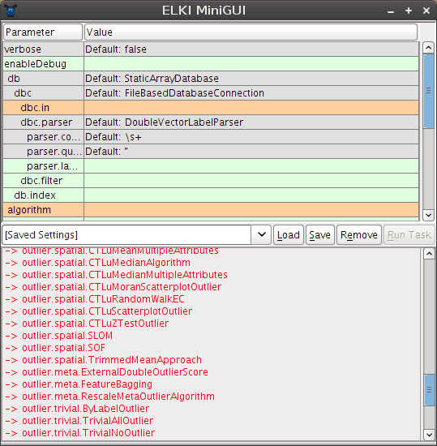
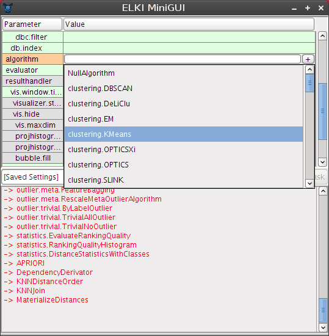
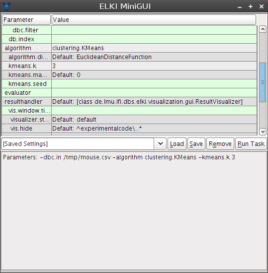
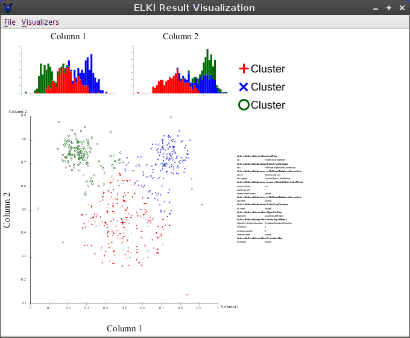
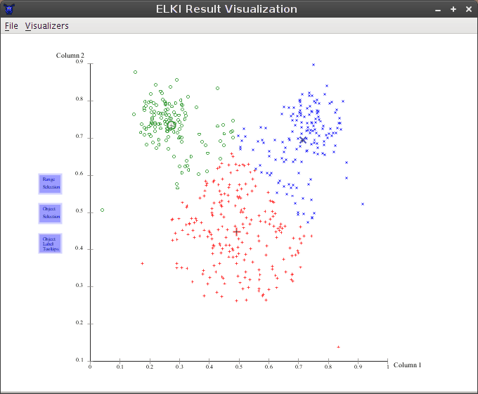
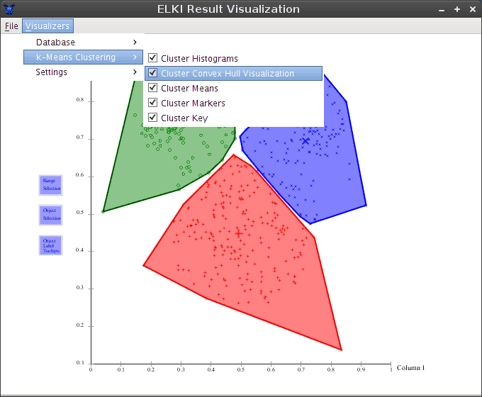
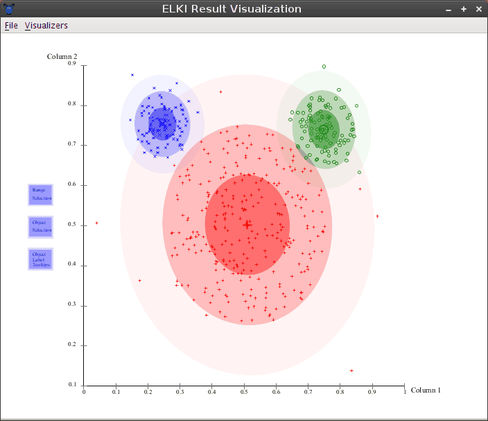

ELKI Tutorial
=============

This tutorial explains a basic use of ELKI, how to use the MiniGUI and the visualizations.

There are additional tutorials available for developing with ELKI.

Tutorials for ELKI:

- [Implementing a custom distance function](/tutorial/distance_functions), a variable exponent Minkowski-norm
- [Implementing a new outlier detection algorithm](/tutorial/outlier), using the distances standard deviation
- [Implementing a k-means clustering variant](/tutorial/same-size_k_means), producing clusters of the same size
- [Implementing hierarchical clustering](/tutorial/hierarchical_clustering), refining the implementation to improve performance and allow other linkage methods
- [Implementing an index accelerated distance function](/tutorial/spatial_distance_functions) for R-tree and similar indexes.
- [Implementing the kNN graph based outlier detection method ODIN](/tutorial/outlier_ODIN) (with automatic index acceleration).
- [Implementing a custom output format using the result handler API](/tutorial/result_handler).
- (more to come ...)

Also see the [HowTo](/howto) and [Examples](/examples) section, which covers more topics, but in less detail.

Preparation
-----------

This tutorial uses [Release 0.4](/releases) of ELKI, however the [Release 0.5.0](/releases) works essentially the same way (but there may be some additional options available).

We analyze the ['"mouse" data set'](/datasets) you can find on the [DataSets](/datasets) page.

You should have the files "`elki.jar`" and "`mouse.csv`".

Running ELKI
------------

The simplest way is to just run the jar file, either by double-clicking it or by typing "`java -jar elki.jar`". This will bring an automatically generated graphical UI similar to this:

The window contains three main components. In the top, a tabular view of parameters is presented. Second, a dropdown and a few buttons allow the management of saved settings, in the bottom, a log view will give textual output.

### Parameter table

The parameter table will dynamically change as you set parameters, since for example adding an algorithm adds new parameters only applicable to this particular algorithm. The colors encode important information on the paranmeters: green parameters are *optional*, grey parameters have a *default value*, while orange parameters are *missing* before the algorithm can be run.

Starting the GUI will generally result in two errors due to missing parameters: you have to choose at least an *input file* (the parameter `dbc.in`) and an algorithm (parameter `algorithm`).

Often the table edit has input assistance such as a file chooser or a dropdown to select amongst known values for this parameter.

### Settings manager

In order to save a setting for later use, type a new name into the dropdown on the left and click on "Save". To load a setting, choose it from the drop down and click on "Load".

Settings are saved in the file `MiniGUI-saved-settings.txt` that you should find easily editable with any text editor. Individual entries are separated with an empty line, and the first line of each section is the title of the setting, while the remaining lines give the options. The syntax is that of the ELKI command line interface, for easy batch operation.

### Log window

The log window will provide you with progress information (when you set `verbose` to true) and other status messages. When the "Run Task" button is grey, you probably have not yet set all required parameters. The log window will report any parameterization errors along with some suggestions on how to set the parameters. In the screenshot above, it gives a list of known algorithms to help you set the `algorithm` parameter.

Analyzing the "mouse" data set
------------------------------

We will analyze the mouse data set with two well-known algorithms, [k-means-clustering](http://en.wikipedia.org/wiki/K-means_clustering) and [EM clustering](http://en.wikipedia.org/wiki/Expectation-maximization_algorithm). This data set is a simple to understand example to see a key difference between these two algorithms.

First of all, we set the `dbc.in` parameter to the input file, `mouse.csv`. If you click on the table, a button with three dots `...` should appear that opens a file selector. Use this to locate the `mouse.csv` file you downloaded from the [DataSets](/datasets) page.

For setting the `algorithm` parameter, a similar button marked with a plus `+` is available, that opens a dropdown with algorithms the UI detected:

### K-Means

By setting `algorithm` to `clustering.KMeans` we choose to use the k-Means clustering algorithm. It will require setting an additional parameter, `kmeans.k` that will appear below. Set this parameter to `3` for this data set. Leave the other k-Means parameters as is for now: the `kmeans.maxiter` parameter allows to limit the k-Means runtime, while the `kmeans.seed` parameter can be used to enforce reproducible results for this algorithm, by using a fixed random generator. We need neither of that for now.

Additionally, we set the parameter `evaluator` to `paircounting.EvaluatePairCountingFMeasure`, which will run a standard evaluation method for clustering results. Note that not all evaluators are applicable for evaluating clustering results.

The log window now only gives the command line summary of our parameters, and the `Run Task` button is now enabled, which we now click to run the algorithm.

### Visualization

After running the algorithm, the GUI by default opens a simple visualization window. This is automatically generated, so the layout is not (yet) the most intuitive, but it does a fairly good job at making visualizations accessible.

In the main area, three types of visualizations are separated: \* At the top, you see 1 dimensional histogram projections for both dimensions of the data set \* Below this, you see a single 2-dimensional projection. If this data set had more dimensions, you would see additional projections here. \* On the right, you see various "special" visualizations, in this case a key of the cluster markers, the evaluation result of 0.71 (since this algorithm involes random, you might get a slightly different number each time) and an overview of the parameters used to produce this results. The exact arrangement of visualizations depends on a dynamic layouting algorithm and may change with your screen size and your data sets.

The 2d projection is most interesting for us, and by clicking it we can show it in the full window:

This shows the clustering as obtained by a typical k-Means run. Note that there are three larger symbols, one for each cluster. The larger symbols give the cluster means. In this algorithm, each object is assigned to the cluster where the distance to the mean is the smallest.

To get a more visual impression of the cluster shapes, we can go to the menu and enable the "Cluster Convex Hull Visualization" module for this clustering result:

Now you can see more clearly the non-overlapping partitioning produced by this algorithm (more precisely, it produces [Voronoi cells](http://en.wikipedia.org/wiki/Voronoi_diagram). It has a tendency to produce clusters of the same size, which is not appropriate for this data set.

### EM-Clustering

Much more appropriate for this data set is the EM algorithm. Close the visualization window, and replace the value of the `algorithm` parameter with `clustering.EM`. For now make sure to *replace* the value, we don't want to run both k-Means and EM since the overlapping results will be less useful. Again, set `em.k` to `3`, too.

The F-Measure obtained by EM-Clustering is much better, usually around 0.97. This is because this data set consists mostly of three Gaussian clusters, the prime example for EM clustering.

Note that an additional visualizer as automatically enabled to visualize the Gaussian clusters discovered by EM:

Exporting results
-----------------

The MiniGUI will by default use the result visualizer to visually display the results. If you want to write them to a folder, you can set the parameter `-resulthandler ResultWriter` to dump the clustering result into files (in a GNUPlot compatible output format).

Extending ELKI
--------------

In the [distance function tutorial](/tutorial/distance_functions) you will learn how to implement a custom distance function for ELKI, the [outlier tutorial](/tutorial/outlier) shows how to add a new outlier detection method, the [same-size k-Means tutorial](/tutorial/same-size_k_means) constructs a k-means variation.
