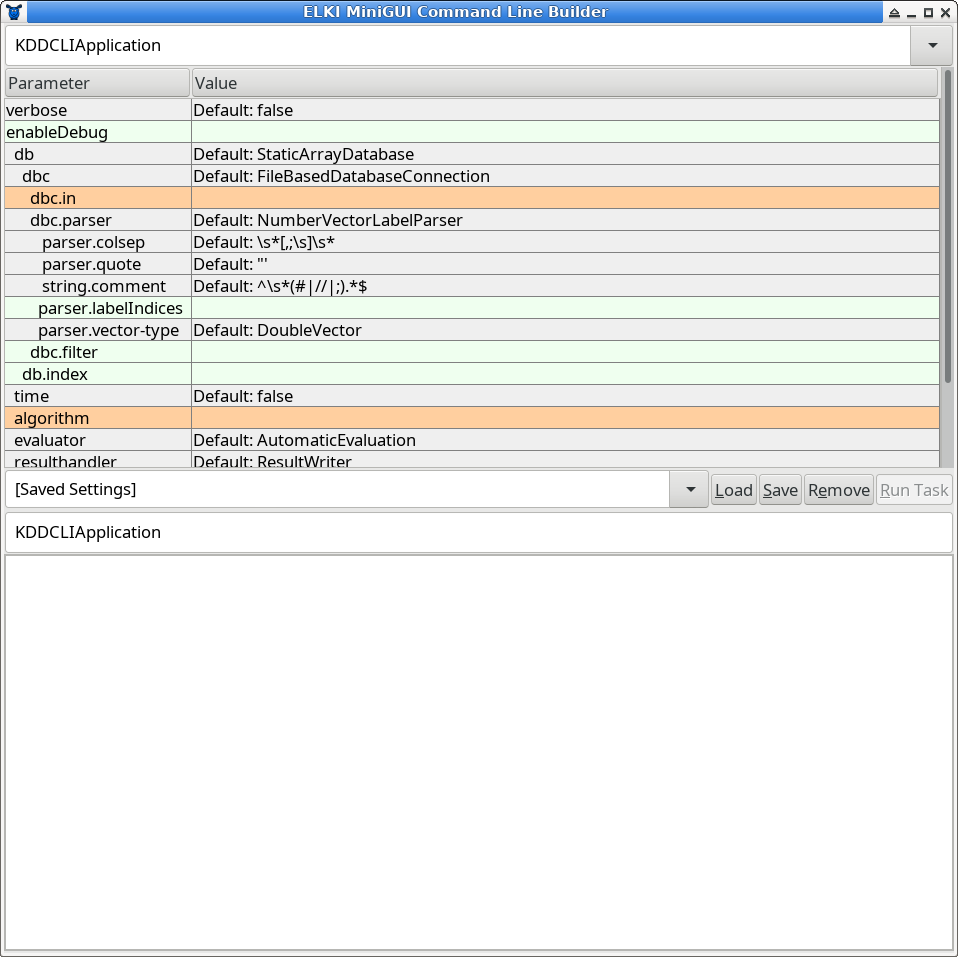
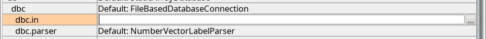
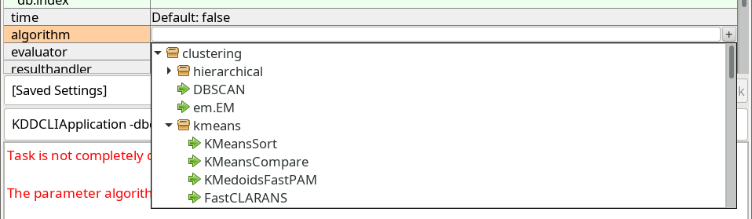
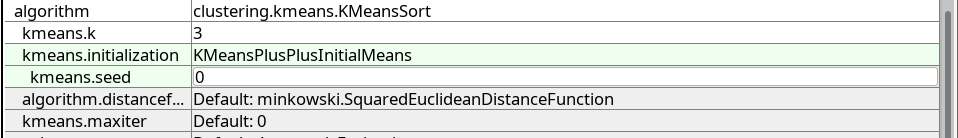
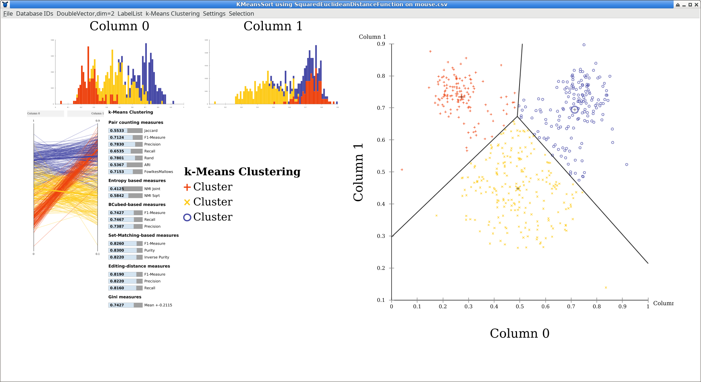
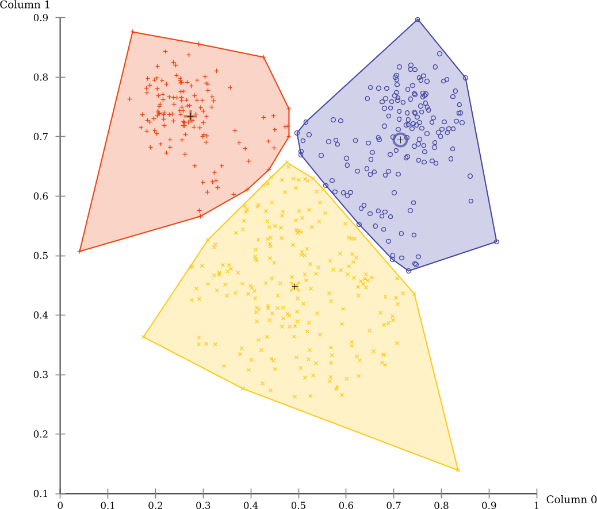
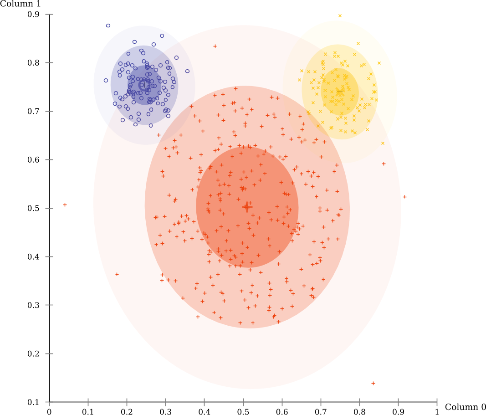

ELKI Tutorials
==============

The [tutorial below](#basic-usage-example) explains a basic use of ELKI, how to use the MiniGUI and the visualizations.

There are additional tutorials available for *developing* with ELKI.

Tutorials for ELKI *development*:

- [Implementing a custom distance function](/tutorial/distance_functions), a variable exponent Minkowski-norm
- [Implementing a new outlier detection algorithm](/tutorial/outlier), using the distances standard deviation
- [Implementing a k-means clustering variant](/tutorial/same-size_k_means), producing clusters of the same size
- [Implementing hierarchical clustering](/tutorial/hierarchical_clustering), refining the implementation to improve performance and allow other linkage methods
- [Implementing an index accelerated distance function](/tutorial/spatial_distance_functions) for R-tree and similar indexes.
- [Implementing the kNN graph based outlier detection method ODIN](/tutorial/outlier_ODIN) (with automatic index acceleration).
- [Implementing a custom output format using the result handler API](/tutorial/result_handler).
- (more to come ...)

Also see the [HowTo](/howto) and [Examples](/examples) section, which covers more topics, but in less detail.

Basic Usage Example
===================

This tutorial uses [Release 0.7.5](/releases) of ELKI.

We analyze the ["mouse" data set (CSV)](https://raw.githubusercontent.com/elki-project/elki/master/data/synthetic/Vorlesung/mouse.csv) you can find on the [DataSets](/datasets) page.

You should have the files "`elki-bundle-0.7.5.jar`" and "`mouse.csv`".

Running ELKI
------------

The simplest way is to just run the jar file, either by double-clicking it or by typing "`java -jar elki.jar`". This will bring an automatically generated graphical UI similar to this:

At the very top, you can select the task. The default task is called `KDDCLIApplication`, meaning that we build parameters for a
KDD (Knowledge Discovery in Databases) process that can be run by out command line interface (CLI), too.
You can also choose experiments and some utility functions here, for example the task to precompute a distance matrix and write it to a file.

Below this, you have a tabular view of parameters. This table is *updated dynamically*, so do not be surprised if new options appear as you make choices.
Third, there is a text entry to save the current parameters, and to load previous parameters by name.
The lower text box is read only, and represents a *serialized* list of the current parameters, useful for copying this into
a shell script, Makefile, or similar, in order to automate experiments. Last, there follows a log window (which may also contain some progress bars).

### Parameter Table

The parameter table will dynamically change as you set parameters, since for example adding an algorithm adds new parameters only applicable to this particular algorithm. The colors encode important information on the paranmeters: green parameters are *optional*, grey parameters have a *default value*, while orange parameters are *missing* before the algorithm can be run.

Starting the GUI will generally result in two errors due to missing parameters: you have to choose at least an *input file* (the parameter `dbc.in`) and an algorithm (parameter `algorithm`).
Often the table edit has input assistance such as a file chooser or a dropdown to select amongst known values for this parameter
that will become available if you select the input cell.

### Settings Manager

In order to save a setting for later use, type a new name into the dropdown on the left and click on "Save". To load a setting, choose it from the drop down and click on "Load".

Settings are saved in the file `MiniGUI-saved-settings.txt` that you should find easily editable with any text editor. Individual entries are separated with an empty line, and the first line of each section is the title of the setting, while the remaining lines give the options. The syntax is that of the ELKI command line interface, for easy batch operation.

### Log Window

The log window will provide you with progress information (when you set `verbose` to true) and other status messages. When the "Run Task" button is grey, you probably have not yet set all required parameters. The log window will report any parameterization errors along with some suggestions on how to set the parameters. In the screenshot above, it gives a list of known algorithms to help you set the `algorithm` parameter.

Analyzing the "mouse" Data Set
------------------------------

We will analyze the mouse data set with two well-known algorithms, [k-means-clustering](http://en.wikipedia.org/wiki/K-means_clustering) and [EM clustering](http://en.wikipedia.org/wiki/Expectation-maximization_algorithm). This data set is a simple to understand example to see a key difference between these two algorithms.

First of all, we set the `dbc.in` parameter to the input file, `mouse.csv`. Click on the right hand side of the orange highlighted (missing) `dbc.in` parameter.

At the right side of the cell, a content assist button with three dots <kbd>...</kbd> appears that opens a file selector. Use this to locate the `mouse.csv` file.
Press Enter <kbd>&#9166;</kbd> to confirm (or click a different row), and the row should turn white now.

Next, we choose the `algorithm` parameter. When we click the row, a similar button marked with a plus <kbd>+</kbd> appears, which opens a dropdown with known choices:

### K-Means Clustering

ELKI contains many different k-Means algorithm. The standard algorithm, often attributed to Lloyd is one of the slowest. The first choice in the
`clustering.kmeans` package (a shortened name for the Java package name `elki.clustering.kmeans`) is one of the better
algorithms, `KMeansSort`. Other good alternatives include `KMeansAnnulus` and `KMeansExponion`. Most of these will give the exact same result,
and only differ in their run time.

After choosing the k-Means algorithm and pressing Enter <kbd>&#9166;</kbd>, new options appear below.

k-Means clustering requires the specification of k, the number of clusters. Set `kmeans.k` to <kbd>3</kbd>.
The initialization parameter `kmeans.initialization` has a default value, but we would rather like to use the better `KMeansPlusPlusInitialMeans` approach.
To always get the same result, we also fix the random generator by setting `kmeans.seed` to <kbd>0</kbd>:

If you want, you can also enable the parameter `verbose` at the very top of the parameter table (the second `verbose` further increases verbosity).

You can now run k-Means by clicking the <kbd>Run Task</kbd> button.

### Automatic Visualization

After running the algorithm, the GUI by default opens a simple visualization window.
The layout is automatically generated to adapt to different window sizes, so the locations of the plots can vary.
Usually, the overview will contain one-dimensional histograms in the top left, a scatterplot matrix below
(here, a single scatterplot is generated because the data is two dimensional,
and the plot is moved to the right to make it larger). At the left you can see a
[parallel coordinates plot](https://en.wikipedia.org/wiki/Parallel_coordinates) which become more useful with higher dimensional data.
The bar chart is an automatic quality evaluation run on the clustering, because the data set also contained labels.
There is a key to the symbols and colors used (but all clusters are just named "Cluster" because k-means cannot infer meaningful names).

You can click some of the components to make them larger. Click on the scatterplot now.

The black lines in the scatterplot were added automatically by ELKI and are the
[Voronoi cells](https://en.wikipedia.org/wiki/Voronoi_diagram) of the clustering.
Click on "DoubleVector,dim=2 Scatterplot" in the menu (the first part is the data type visualized),
and uncheck "k-means Voronoi cells" to hide this layer. Then enable "Cluster hull" instead.

There are also markers that indicate the cluster means, and you can enable a "star" visualization where each point is connected to the nearest cluster mean.
Some of these visualizations are only available on 2d data, and some are only available for k-means clustering (Voronoi cells, for example).

Now you can see more clearly the non-overlapping partitioning produced by this algorithm.
k-Means has a tendency to produce clusters of the same size, which is not appropriate for this data set.

### EM-Clustering

Much more appropriate for this data set is the EM algorithm.
Close the visualization window, and replace the value of the `algorithm` parameter with `clustering.em.EM`.
For now make sure to *replace* the value, we don't want to run both k-Means and EM at the same time. Again, set `em.k` to `3`, too.

The evaluation scores by EM-Clustering on this data set are much better.
This is because this data set consists mostly of three Gaussian clusters, the prime example for EM clustering.

Note that an additional visualizer as automatically enabled to visualize the Gaussian clusters discovered by EM:

Exporting results
-----------------

The MiniGUI will by default use the result visualizer to visually display the
results. If you want to save them to a folder, you can set the parameter
`-resulthandler ResultWriter` to dump the clustering result into files (in a
GNUPlot compatible CSV output format, separated with whitespace characters).

Extending ELKI
--------------

In the [distance function tutorial](/tutorial/distance_functions) you will learn how to implement a custom distance function for ELKI, the [outlier tutorial](/tutorial/outlier) shows how to add a new outlier detection method, the [same-size k-Means tutorial](/tutorial/same-size_k_means) constructs a k-means variation.
