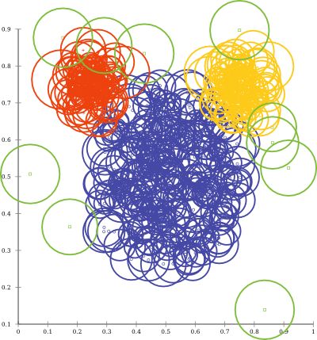
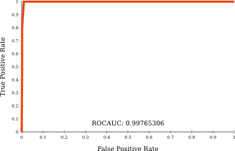
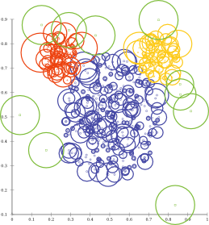

Implementing ODIN, a kNN outlier method
=======================================

Version information: Updated for ELKI 0.6.5~20141030
{: class="compact" style="font-size: x-small; text-align:right" }

In this tutorial, we will implement a rather simple algorithm for outlier detection, based on the in-degree of the k nearest neighbor graph. The method is called ODIN ([Article on IEEExplore](http://dx.doi.org/10.1109/ICPR.2004.1334558)), and we will implement a curried version of it.

When an index such as the R\*-tree, k-d-tree or LSH is added to the database, the method will run substantially faster, while this does not require any changes to the code below. We get this for free by using the kNN query functionality of ELKI.

This tutorial was developed for the KDD I class summer term 2013 and the ELKI 0.6.0 release.

Algorithm stub
--------------

We create a new class named ODIN. As base class we chose [AbstractDistanceBasedAlgorithm](/releases/0.7.5/doc/de/lmu/ifi/dbs/elki/algorithm/AbstractDistanceBasedAlgorithm.html), and implementing the [OutlierAlgorithm](/releases/0.7.5/doc/de/lmu/ifi/dbs/elki/algorithm/outlier/OutlierAlgorithm.html) interface forces us to use the result type [OutlierResult](/releases/0.7.5/doc/de/lmu/ifi/dbs/elki/result/outlier/OutlierResult.html). The full stub looks like this:


package tutorial.outlier;

import de.lmu.ifi.dbs.elki.algorithm.AbstractDistanceBasedAlgorithm;
import de.lmu.ifi.dbs.elki.algorithm.outlier.OutlierAlgorithm;
import de.lmu.ifi.dbs.elki.data.type.TypeInformation;
import de.lmu.ifi.dbs.elki.database.Database;
import de.lmu.ifi.dbs.elki.result.outlier.OutlierResult;

public class ODIN<O>
    extends AbstractDistanceBasedAlgorithm<O, OutlierResult>
    implements OutlierAlgorithm {

  protected ODIN(DistanceFunction<? super O> distanceFunction) {
    super(distanceFunction);
    // TODO Auto-generated constructor stub
  }

  @Override
  public TypeInformation[] getInputTypeRestriction() {
    // TODO Auto-generated method stub
    return null;
  }

  @Override
  protected Logging getLogger() {
    // TODO Auto-generated method stub
    return null;
  }
}


The generics were set "agnostic" - so `O` can be anything; whatever our distance function supports.

The logger is the usual `private static final` logging reference:


  private static final Logging LOG = Logging.getLogger(ODIN.class);

  @Override
  protected Logging getLogger() {
    return LOG;
  }


this allows the super class to correctly log using our algorithms name.

First of all, we will be modifing the constructor: we know we are going to need a parameter `k`, and we will make the constructor `public`. Note that the super class already takes care of the distance function.


  int k;

  public ODIN(DistanceFunction<? super O> distanceFunction, int k) {
    super(distanceFunction);
    this.k = k;
  }


The input type is determined by the distance function - we can just pass on the type information (we can deal with whatever data our distance function accepts!):


  @Override
  public TypeInformation[] getInputTypeRestriction() {
    return TypeUtil.array(getDistanceFunction().getInputTypeRestriction());
  }


The `run` method
----------------

Again, the "optimal" signature of the run method cannot be automatically determined by eclipse: some algorithms need multiple relations, for example. The signature that we have to implement is determined by the type information we just gave: it constists of a `Database` and one `Relation` for each type we requested. Since we requested a single type, compatible with out distance function, it will be a relation `Relation<O>`:


  public OutlierResult run(Database database, Relation<O> relation) {
    // TODO Auto-generated method stub
    return null;
  }


Our algorithm is based on the k nearest neighbors. Since this is an operation that can be *accelerated* well by a database, we will get a nearest neighbor query from the database, for our relation and distance function. Essentially, we bind the abstract distance query to a database, and then get a nearest neighbor search for this distance. At this point, ELKI will automatically choose the most appropriate kNN query class. If there exist an appropriate index for our distance function (not every index can accelerate every distance!), it will *automatically* be used here.


    DistanceQuery<O> dq = database.getDistanceQuery(relation, getDistanceFunction());
    KNNQuery<O> knnq = database.getKNNQuery(dq, k);


Secondly, we need to know the objects we will analyze and setup our output data store:


    DBIDs ids = relation.getDBIDs();
    WritableDoubleDataStore scores = DataStoreUtil.makeDoubleStorage(ids,
        DataStoreFactory.HINT_DB | DataStoreFactory.HINT_HOT, 0.);


the best way to think of the `scores` is a `Map<DBID, Double>` - except that it will be much more efficient. The hints are meant to allow the database to better decide which data structure to choose, and whether to keep the data in memory or save it to disk. Since these will be the output scores, we give the hint indicating that the values should go to the database: `HINT_DB`

Now we can process each object in the data set using an iterator:


    for (DBIDIter iter = ids.iter(); iter.valid(); iter.advance()) {
        // see below
    }


Again, the iterators in ELKI differ slightly from the Java API of `Iterator<DBID>` - and again, the reason is efficiency. Creating tiny objects such as `DBID` can cause a large overhead. The ELKI API effectively avoids this by re-using the iterator itself as reference to an object. (The iterators in ELKI are quite similar to iterators in C++, actually.)

For each object, we will acquire the k nearest neighbors (which will be accelerated if our database has e.g. an R-tree index) and then *iterate of the neighbors*, too:


      KNNList neighbors = knnq.getKNNForDBID(iter, k);
      for (DBIDIter nei = neighbors.iter(); nei.valid(); nei.advance()) {
        if (DBIDUtil.equal(iter, nei)) {
          continue;
        }
        scores.put(nei, scores.doubleValue(nei) + 1);
      }


For each of the neighbors, we increase the in-degree (=score) by one. We could have used integers, but doubles will be reliable enough, and postprocessing algorithms will expect double scores anyway. Note that we use `DBIDUtil.equal` to check whether the object is its own neighbor: in a database context, a kNN search will usually return the query object with a distance of 0! We must not use `==`: the two iterators obviously are not *identical*. However, they may reference the same object, which is conveniently tested by `DBIDUtil.equal`.

The `getKNNForDBID` method may boil down to a slow linear scan, but when the database has an appropriate index, the index query will be used. Then the algorithm can run in `O(n k log n)` or even `O(n k)` time.

Last but not least, we have to return our result for evaluation, visualization and post-processing. For this we need to provide some meta data on the value range and meaning of our score: minimum and maximum, but also that for this algorithm, low values indicate outlierness. We then wrap the data store in a relation and return the result (the two name strings of the relation will be used in the menus and output file names.)


    double min = Double.POSITIVE_INFINITY, max = 0.0;
    for (DBIDIter iter = ids.iter(); iter.valid(); iter.advance()) {
      min = Math.min(min, scores.doubleValue(iter));
      max = Math.max(max, scores.doubleValue(iter));
    }
    OutlierScoreMeta meta = new InvertedOutlierScoreMeta(min, max);
    DoubleRelation rel = new MaterializedDoubleRelation(
      "ODIN In-Degree", "odin", scores, ids);
    return new OutlierResult(meta, rel);


Adding the Parameterizer
------------------------

Parameterizers in ELKI serve the purpose of connecting the UIs (both the command line and the graphical UIs) to the Java classes. Here, there are two parameters to set: the distance function and `k`.

We can inherit the distance function from the Parameterizer of the super class, which yields the following code to start with:


  public static class Parameterizer<O>
      extends AbstractDistanceBasedAlgorithm.Parameterizer<O> {
    @Override
    protected void makeOptions(Parameterization config) {
      super.makeOptions(config);
    }

    @Override
    protected ODIN<O> makeInstance() {
      return null;
    }
  }


We now need to add a Parameter for `k`. We need a static [OptionID](/releases/0.7.5/doc/de/lmu/ifi/dbs/elki/utilities/optionhandling/OptionID.html), which consists of the parameter name and a description, and a Java variable to store the value in.


    public static final OptionID K_ID = new OptionID("odin.k",
       "Number of neighbors to use for kNN graph.");
    
    int k;


Now we can "get" the parameter in the `makeOptions` method:


    @Override
    protected void makeOptions(Parameterization config) {
      super.makeOptions(config);
      
      IntParameter param = new IntParameter(K_ID);
      param.addConstraint(new GreaterConstraint(1));
      if (config.grab(param)) {
        k = param.intValue();
      }
    }


we *keep* the super method invokation, as this is where the distance function parameter is being set. For the `k` parameter, we use an [IntParameter](/releases/0.7.5/doc/de/lmu/ifi/dbs/elki/utilities/optionhandling/parameters/IntParameter.html). Furthermore we add the constraint that k must be at least 2: in a database, the query object will be its own nearest neighbor! `config.grab(param)` will try to set the parameter, and when successful we can access its value. If the parameter was not set, `config` will keep track of the error. We do not want to throw an exception here - instead, all errors should be reported to the `config` object, so they can all be reported at *once*.

Now we have the distance function and `k` and can instantiate our class in the `makeInstance` method:


    @Override
    protected ODIN<O> makeInstance() {
      return new ODIN<>(distanceFunction, k);
    }


Testing the algorithm
---------------------

We can now launch the GUI (or use the command line) to test our algorithm. We need to specify the `k` parameter (the distance function will default to Euclidean distance) and choose a data set. With our favorite "mouse" example and `-odin.k 10`, we get automatic visualization via a bubble plot:

and also automatic evaluation using a ROC curve:

While the bubble plot is quite a mess (because the ODIN method does not return calibrated scores), we can see that the green bubbles are larger than e.g. the blue ones. The ROC plot shows us that the resulting outlier ranking is actually pretty good - almost 1.0!

Bonus: Better visualization by improving the metadata
-----------------------------------------------------

We can actually improve above visualization quite easily, by providing additional metadata. We need to change a single line:


    OutlierScoreMeta meta = new InvertedOutlierScoreMeta(min, max,
       0., ids.size() - 1, k);


the three additional values we added are: theoretical minimum (obviously, ODIN scores can become 0), theoretical maximum (every other object - so `ids.size() - 1`) and a baseline value. The baseline value is most helpful here: if we set this to the *expected* value for regular objects, these will be scaled to have no outlier bubble. A naive expectation is that each object will have as many in-links as it has out-links, i.e. `k`.

With this slight modification, the automatic visualization can produce a clearly more useful result:

We can now tell that apparently the leftmost red objects is ranked worse than the green one just above the red cluster; this is why ODIN did not score perfect on this data set.

Bonus: add scientific reference
-------------------------------

In order to document who came up with the idea of this algorithm, we are going to attach a scientific reference to the method. It will then show up in the documentation. For the Wiki, we put this on the page [RelatedPublications](/related).

To the class definition, we will add the following Java annotation:


@Reference(
    authors="V. Hautamäki and I. Kärkkäinen and P Fränti",
    title="Outlier detection using k-nearest neighbour graph",
    booktitle="Proc. 17th Int. Conf. Pattern Recognition, ICPR 2004",
    url="http://dx.doi.org/10.1109/ICPR.2004.1334558")
public class ODIN<O> // ...


We also put the same information into the [JavaDoc](/dev/javadoc) of the class. This makes it easier for people finding the appropriate scientific background of the algorithm that we just implemented. We should also make a note that we *modified* their algorithm slightly: instead of using a threshold, we "curried" the method and return the threshold at which the point would become an outlier as score.

[You can browse the full source code online, in the tutorial folder](https://github.com/elki-project/elki/blob/master/addons/tutorial/src/main/java/tutorial/outlier/ODIN.java)
