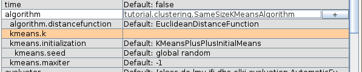
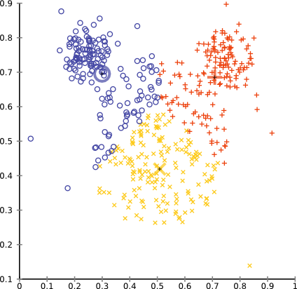
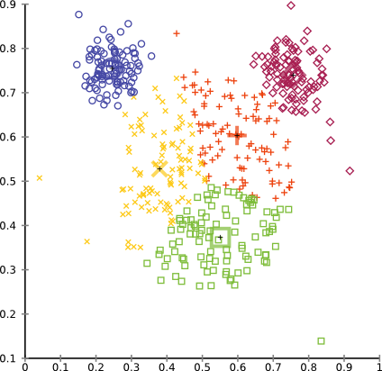

Same-size k-Means Variation
===========================

Version information: ELKI 0.7.1
{: class="versioninfo" }

In this tutorial, we will create a **k-means variation** that produces clusters of the same size.

The basic idea of the algorithm is as follows:

Initialization:

1. Compute the desired cluster size, n/k.
2. Initialize means, preferably with k-means++
3. Order points by the distance to their nearest cluster minus distance to the farthest cluster (= biggest benefit of best over worst assignment)
4. Assign points to their preferred cluster until this cluster is full, then resort remaining objects, without taking the full cluster into account anymore

This initialization is not optimal - feel free to contribute an improvement to this tutorial! - in particular for the last cluster. But it will do as an initialization method.

Additional data structure: for every cluster we keep a list of objects willing to leave the cluster. This makes it easier to find transfer candidates. Whenever we have an element that wants to enter a cluster, the top element wanting to leave will be considered for switching. (It may be worth a try to consider more than the top element!)

Iteration:

1. Compute current cluster means
2. For each object, compute the distances to the cluster means
3. Sort elements based on the delta of the current assignment and the best possible alternate assignment.
4. For each element by priority:
   1. For each other cluster, by element gain, unless already moved:
      1. If there is an element wanting to leave the other cluster and this swap yields and improvement, swap the two elements
      2. If the element can be moved without violating size constraints, move it
   2. If the element was not changed, add to outgoing transfer list.
5. If no more transfers were done (or max iteration threshold was reached), terminate

Convergence can be proven the same way as with k-means: any transfer must decrease variance (and would also happen in k-means).

Room for improvement: better logic for finding optimal transfers, e.g. by solving triangles: object 1 from A to B, object 2 from B to C, object 3 from C to A also preserves sizes!

Auto-generated code
-------------------

Since this is a K-means variant, we can use the base class [AbstractKMeans](/releases/release0.7.5/javadoc/de/lmu/ifi/dbs/elki/algorithm/clustering/kmeans/AbstractKMeans.html). Generating the standard methods, adding a logger and choosing the generics yields the following code blueprint.

For the generics, we want to allow arbitrary vector types: `V extends NumberVector`.The cluster model will be a simple `MeanModel` (using a `KMeansModel` instead would trigger Voronoi cell visualization, which is no longer appropriate). The reason why we have to choose these generics is that the abstract class `AbstractKMeans` is also used e.g. for KMedians and similar algorithms with looser constraints than KMeans or our new variation.

For the constructor, we *narrow down* the distance function to a `NumberVectorDistanceFunction<? super V>`. This would only be automatic if we had this yet another generic in `AbstractKMeans`. This narrower distance function has two properties important to us: A) it can be computed on arbitrary number vectors (including the means, we will be computing) and B) they return a double value. In case you are wondering: yes, in ELKI there exist distance functions not defined on number vectors and not having double values.


package tutorial.clustering;

import de.lmu.ifi.dbs.elki.algorithm.clustering.kmeans.AbstractKMeans;
import de.lmu.ifi.dbs.elki.algorithm.clustering.kmeans.KMeansInitialization;
import de.lmu.ifi.dbs.elki.data.NumberVector;
import de.lmu.ifi.dbs.elki.data.model.KMeansModel;
import de.lmu.ifi.dbs.elki.distance.distancefunction.NumberVectorDistanceFunction;
import de.lmu.ifi.dbs.elki.logging.Logging;

public class SameSizeKMeansAlgorithm<V extends NumberVector>
    extends AbstractKMeans<V, MeanModel> {
  /**
   * Class logger
   */
  private static final Logging LOG = Logging.getLogger(SameSizeKMeansAlgorithm.class);

  /**
   * Constructor.
   * 
   * @param distanceFunction Distance function
   * @param k K parameter
   * @param maxiter Maximum number of iterations
   * @param initializer
   */
  public SameSizeKMeansAlgorithm(
      NumberVectorDistanceFunction<? super V> distanceFunction,
      int k, int maxiter, KMeansInitialization<? super V> initializer) {
    super(distanceFunction, k, maxiter, initializer);
  }

  @Override
  protected Logging getLogger() {
    return LOG;
  }
}


The main method stub
--------------------

Note that no `run` method was generated automatically. This is due to a limitation in Java interfaces, and ELKI allowing multi-relational algorithms. Our algorithm, however, is just single relational. So we can use a very simple `run` method:


  /**
   * Run k-means.
   * 
   * @param database Database
   * @param relation relation to use
   * @return result
   */
  public Clustering<MeanModel> run(Database database, Relation<V> relation) {
    // TODO
    return null;
  }


In contrast to the [outlier tutorial](/tutorial/outlier), we do not have to implement `getInputTypeRestriction()` - we inherit an appropriate implementation from `AbstractKMeans` (which actually uses the restriction given by the distance function).

Object metadata
---------------

To find the optimal assignment and evaluate transfers, we need some data on the objects ready. We will need some extra memory for this, on the order of O(n\*k). In particular, we want to track the distances from each object to each cluster center, but also which cluster the object is the closest to, and which would be a better choice. For this, we need a simple utility inner class, which we call `Meta`:


  private class Meta {
    /**
     * Distance to the cluster centers.
     */
    double[] dists;

    /**
     * Indexes: primary assignment (current or best), secondary assignment
     * (second best or worst). The actual meaning differs from initialization to
     * iteration phase!
     */
    int primary, secondary;

    /**
     * Constructor.
     * 
     * @param k
     */
    protected Meta(int k) {
      dists = new double[k];
      Arrays.fill(dists, Double.POSITIVE_INFINITY);
      primary = 0;
      secondary = 0;
    }
  }


to make the code more readable, we also add two utility functions to this inner class. The first, `priority` computes the priority we use in the initialization phase: the difference between the worst and the best assignments. The second, `gain` computes the expected gain from moving the object from the current assignment to a different cluster.


    /**
     * Priority / badness: difference between best and worst. (Assuming that
     * "secondary" is the worst).
     * 
     * @return Priority
     */
    protected double priority() {
      return dists[secondary] - dists[primary];
    }

    /**
     * Gain from switching to cluster i.
     * 
     * @param i Target cluster
     * @return Gain
     */
    protected double gain(int i) {
      return dists[primary] - dists[i];
    }


and of course we need to build an initial data storage. First, we need to cast the distance function (unless we add yet another generics to the parent class!). Then we get a storage from the data storage layer. Depending on the database size and properties, this can be anything like an array (the default case for static data sets), a hash map (the default for dynamic data sets) or a B-tree (in the future, for data sets that don't fit into main memory).

We then iterate over all objects. `for (DBIDIter id = relation.iterDBIDs(); id.valid(); id.advance()) {` is the usual iterator construct in ELKI. This needs less memory than the usual java `Iterator` classes for [reasons outlined here](/dev/dbids). We then compute the distance to each mean, and track the largest (in `c.primary`) and smallest (in `c.secondary`) such distance to be used in the initialization phase.


  protected WritableDataStore<Meta> initializeMeta(Relation<V> relation, double[][] means) {
    NumberVectorDistanceFunction<? super V> df = getDistanceFunction();
    // The actual storage
    final WritableDataStore<Meta> metas = DataStoreUtil.makeStorage(relation.getDBIDs(),
        DataStoreFactory.HINT_HOT | DataStoreFactory.HINT_TEMP, Meta.class);
    // Build the metadata, track the two nearest cluster centers.
    for (DBIDIter id = relation.iterDBIDs(); id.valid(); id.advance()) {
      Meta c = new Meta(k);
      V fv = relation.get(id);
      for (int i = 0; i < k; i++) {
        final double d = c.dists[i] = df.distance(fv, DoubleVector.wrap(means[i]));
        if (i > 0) {
          if (d < c.dists[c.primary]) {
            c.primary = i;
          }
          else if (d > c.dists[c.secondary]) {
            c.secondary = i;
          }
        }
      }
      metas.put(id, c);
    }
    return metas;
  }


Performing the initial assignment
---------------------------------

For the initial assignment, we first will need to sort the data set. Technically, we are just sorting references to the database, which can conveniently be done in a `ArrayModifiableDBIDs` class. This class is similar to an `ArrayList<DBID>`, but again will use significantly less memory. Plus, it offers additional functionality. For sorting we need a comparator, which will compare objects by the `priority` method we defined above.


  protected ArrayModifiableDBIDs initialAssignment(List<ModifiableDBIDs> clusters,
      final WritableDataStore<Meta> metas, DBIDs ids) {
    // Build a sorted list of objects, by descending distance delta
    ArrayModifiableDBIDs tids = DBIDUtil.newArray(ids);
    // Our desired cluster size:
    final int maxsize = (tids.size() + k - 1) / k; // rounded up
    // Comparator: sort by largest benefit of assigning to preferred cluster.
    final Comparator<DBIDRef> comp = new Comparator<DBIDRef>() {
      @Override
      public int compare(DBIDRef o1, DBIDRef o2) {
        Meta c1 = metas.get(o1), c2 = metas.get(o2);
        return -Double.compare(c1.priority(), c2.priority());
      }
    };
    // We will use this iterator below. It allows seeking!
    DBIDArrayIter id = tids.iter();


For the actual initialization, we may need to resort multiple times. We use the variable `start` to track which elements we already processed, and only sort the elements after this. This time we need an advanced iterator: `DBIDArrayIter` can not only move forward, but can also move backward and seek to arbitrary positions in the array. We use this to seek to the starting position of the current iteration.


    // Initialization phase:
    for (int start = 0; start < tids.size();) {
      tids.sort(start, tids.size(), comp);
      for (id.seek(start); id.valid(); id.advance()) {


We now assign the next element to it's preferred cluster. The cluster cannot be full yet, which we will actually ensure *below*. If you feel uncomfortable, you can easily add an assertion.


        Meta c = metas.get(id);
        // Assigning to best cluster - which cannot be full yet!
        ModifiableDBIDs cluster = clusters.get(c.primary);
        cluster.add(id);
        start++;


However, after adding an element, it might be full now. In this case, we want to prevent any further objects of being assigned to this cluster, and also re-sort the data set.


        // Now the cluster may have become completely filled:
        if (cluster.size() == maxsize) {
          final int full = c.primary;


As we can seek back to our current position `start`, we can just use this iterator to go through all remaining objects, and update their preferred cluster assignment, removing the references to the now full cluster. The `continue` taking us to the next iteration (and thus updating the sorting and restarting at `start`) is strictly speaking not necessary: the iterator is at the end of the data set now anyway.


          // Refresh the not yet assigned objects where necessary:
          for (; id.valid(); id.advance()) {
            Meta ca = metas.get(id);
            if (ca.primary == full) {
              // Update the best index:
              for (int i = 0; i < k; i++) {
                if (i == full || clusters.get(i).size() >= maxsize) {
                  continue;
                }
                if (ca.primary == full || ca.dists[i] < ca.dists[ca.primary]) {
                  ca.primary = i;
                }
              }
              metas.put(id, ca); // Changed.
            }
          }
          // The next iteration will perform the sorting!
          break; // not really necessary - iterator is at end anyway.
        }
      }
      // Note: we expect Candidate.a == cluster the object is assigned to!
    }
    return tids;
  }


Note that we ensured that `Meta.primary` contains the cluster number the object is currently assigned to. We do not ensure a particular value for `Meta.secondary`. We could also discard the `tids` array at this point, but we can also just re-use it in the next part.

Updating the means
------------------

For updating the means, we are just going to use the method provided by the abstract super class:


    means = means(clusters, means, relation);


We also need to update the distances from each object to the current (possibly changed!) means. We will do this in a helper function. In addition, we also track which mean would be the best alternate assignment. So after this run, `Meta.primary` still is the cluster the object is currently assigned to, while `Meta.secondary` now is the best other choice.


  protected void updateDistances(Relation<V> relation, double[][] means,
      final WritableDataStore<Meta> metas, NumberVectorDistanceFunction<? super V> df) {
    for (DBIDIter id = relation.iterDBIDs(); id.valid(); id.advance()) {
      Meta c = metas.get(id);
      V fv = relation.get(id);
      // Update distances to means.
      c.secondary = -1;
      for (int i = 0; i < k; i++) {
        c.dists[i] = df.distance(fv, DoubleVector.wrap(means[i]));
        if (c.primary != i) {
          if (c.secondary < 0 || c.dists[i] < c.dists[c.secondary]) {
            c.secondary = i;
          }
        }
      }
      metas.put(id, c); // Changed.
    }
  }


The refinement procedure
------------------------

This brings us finally to the core of our algorithm: the refinement procedure, which performs Lloyd-Forgy-style iterations to improve the result, but in contrast to these ensures that the cluster sizes remain in the given bounds. First of all, we compute these bounds, in the form of an upper and a lower limit, if the number of objects is not divisible by `k`.


  protected double[][] refineResult(Relation<V> relation,
      double[][] means, List<ModifiableDBIDs> clusters,
      final WritableDataStore<Meta> metas, ArrayModifiableDBIDs tids) {
    NumberVectorDistanceFunction<? super V> df = getDistanceFunction();
    // Our desired cluster size:
    final int minsize = tids.size() / k; // rounded down
    final int maxsize = (tids.size() + k - 1) / k; // rounded up


We also need a different comparator than before, which now uses the `Meta.priority` method we wrote earlier.


    // Comparator: sort by largest gain by transfer
    final Comparator<DBIDRef> comp = new Comparator<DBIDRef>() {
      @Override
      public int compare(DBIDRef o1, DBIDRef o2) {
        Meta c1 = metas.get(o1), c2 = metas.get(o2);
        return Double.compare(c1.priority(), c2.priority());
      }
    };


We also need a second comparator. The code will follow below; it's not particularly tricky, but sorts an `int[]` array of cluster numbers `[0..k-1]` by increasing distance to the cluster means.


    // List for sorting cluster preferences
    int[] preferences = MathUtil.sequence(0, k)
    // Comparator for this list.
    final PreferenceComparator pcomp = new PreferenceComparator();


In the idea description of the algorithm we already mentioned transfer lists. We also need to initialize these:


    // Initialize transfer lists:
    ArrayModifiableDBIDs[] transfers = new ArrayModifiableDBIDs[k];
    for (int i = 0; i < k; i++) {
      transfers[i] = DBIDUtil.newArray();
    }


and can now finally start with the main iteration loop. If `maxiter` is set to `-1` we will be performing an infinite number of iterations, otherwise at most `maxiter` iterations. We then call the helper function above to update the distances and sort the objects by their `Meta.priority`. The `active` counter will be used to detect convergence.


    DBIDArrayIter id = tids.iter(); // Will be used below
    for (int iter = 0; maxiter < 0 || iter < maxiter; iter++) {
      updateDistances(relation, means, metas, df);
      tids.sort(comp);
      int active = 0; // Track if anything has changed


We now iterate over the data set and get the metadata. We now use the second comparator to sort the clusters numbers in `preferences` by their distance to the current object and then iterate over each target cluster.


      for (id.seek(0); id.valid(); id.advance()) {
        Meta c = metas.get(id);
        ModifiableDBIDs source = clusters.get(c.primary);
        IntegerArrayQuickSort.sort(preferences, pcomp.select(c));
        tloop: for (int i : preferences) {
          if (i == c.primary) {
            continue; // Cannot transfer to the same cluster!
          }
          ModifiableDBIDs dest = clusters.get(i);


First of all we try to find a waiting transfer partner. The actual transfer will be done by the method `transfer` explained below. Also note that we see yet another iterator variant: `DBIDMIter` is a modifiable iterator - it also has a `remove` method, which we need this time.


          // Can we pair this transfer?
          for (DBIDMIter other = transfers[i].iter(); other.valid(); other.advance()) {
            Meta c2 = metas.get(other);
            if (c.gain(i) + c2.gain(c.primary) > 0) {
              transfer(metas, c2, dest, source, other, c.primary);
              transfer(metas, c, source, dest, id, i);
              active += 2;
              other.remove(); // last, as this invalides the reference!
              source = dest; // We are assigned here now.
              continue tloop;
            }
          }


Even if we do not have a transfer partner, we might be able to move the object: if the number of elements was not divisible by `k` it may be possible to move single objects instead of swapping two objects.


          // If cluster sizes allow, move a single object.
          if (c.gain(i) > 0 && (dest.size() < maxsize && source.size() > minsize)) {
            transfer(metas, c, source, dest, id, i);
            active += 1;
            source = dest; // We are assigned here now.
            continue tloop;
          }
        }


Finally, if the object could not be transferred but isn't in the optimal cluster, we store it in the appropriate transfer list:


        // If the object would prefer a different cluster, put in outgoing
        // transfer list.
        if (c.primary != preferences[0] && c.dists[c.primary] > c.dists[preferences[0]]) {
          transfers[c.primary].add(id);
        }


Someone might come up with a good way of finding additional transfers. But otherwise, we need to clear these lists for the next iteration. We can also log the progress of our algorithm.


      }
      // TODO: try to get more transfers out of the transfer lists done by
      // considering more than one object?
      int pending = 0;
      // Clear transfer lists for next iteration.
      for (int i = 0; i < k; i++) {
        pending += transfers[i].size();
        transfers[i].clear();
      }
      if (LOG.isDebuggingFine()) {
        LOG.debugFine("Performed " + active + " transfers in iteration " + iter + " skipped " + pending);
      }


Finally, if no transfers were done we can break the main iteration loop. If however any change was performed, we need to update the means again.


      if (active <= 0) {
        break;
      }
      // Recompute means after reassignment
      means = means(clusters, means, relation);
    }
    return means;
  }


In the code above two parts were not yet introduced. The first is the comparator for sorting the cluster preferences. This is fairly standard code, except that we are using an `IntegerComparator` instead of a `Comparator<Integer>` from the Java collections framework. By avoiding `Integer` objects and using primitive `int`s instead we reduce memory use and improve performance. This isn't crucial here, but we might as well just use it. The `select` method also serves the purpose that we can use this comparator for different objects instead of creating a fresh one for each `Meta`.


  public class PreferenceComparator implements IntegerComparator {
    Meta c = null;

    @Override
    public int compare(int o1, int o2) {
      return Double.compare(c.dists[o1], c.dists[o2]);
    }

    /**
     * Set the meta to sort by
     * 
     * @param c Meta to sort by
     * @return The comparator
     */
    public IntegerComparator select(Meta c) {
      this.c = c;
      return this;
    }
  }


and the second is the `transfer` function to update the data structures:


  protected void transfer(final WritableDataStore<Meta> metas, Meta meta,
        ModifiableDBIDs src, ModifiableDBIDs dst, DBIDRef id, Integer dstnum) {
    src.remove(id);
    dst.add(id);
    meta.primary = dstnum;
    metas.put(id, meta); // Make sure the storage is up to date.
  }


Implementing the algorithm outline
----------------------------------

We have now seen all the main parts of the algorithm, and only need to put these pieces together to the final `run` method:


  public Clustering<MeanModel> run(Database database, Relation<V> relation) {
    // Database objects to process
    final DBIDs ids = relation.getDBIDs();
    // Choose initial means
    double[][] means = initializer.chooseInitialMeans(relation, k, getDistanceFunction());
    // Setup cluster assignment store
    List<ModifiableDBIDs> clusters = new ArrayList<ModifiableDBIDs>();
    for (int i = 0; i < k; i++) {
      clusters.add(DBIDUtil.newHashSet(relation.size() / k + 2));
    }

    // Meta data storage
    final WritableDataStore<Meta> metas = initializeMeta(relation, means);
    // Perform the initial assignment
    ArrayModifiableDBIDs tids = initialAssignment(clusters, metas, ids);
    // Recompute the means after the initial assignment
    means = means(clusters, means, relation);
    // Refine the result via k-means like iterations
    means = refineResult(relation, means, clusters, metas, tids);


Don't mind the odd signature of `initializer.chooseInitialMeans`. The reason for this is that we want to allow *both* random generated means, samples from the database, optimized means as produced by k-means++ etc. - for now, we will only need them to be "numerical vectors of some kind", which is what this type says.

The main thing we have not seen yet is how to package the final result for the ELKI framework. As we want the visualization and evaluation procedures to be able to use our result, we need to wrap it in the appropriate classes. The outer class is [Clustering](/releases/release0.7.5/javadoc/de/lmu/ifi/dbs/elki/data/Clustering.html), and represents the result as a whole. We then need to produce the individual [Cluster](/releases/release0.7.5/javadoc/de/lmu/ifi/dbs/elki/data/Cluster.html) objects. In ELKI, each cluster has a [Model](/releases/release0.7.5/javadoc/de/lmu/ifi/dbs/elki/data/model/Model.html), in our case the model will store the cluster mean.


    // Wrap result
    Clustering<MeanModel> result = new Clustering<MeanModel>("k-Means Samesize Clustering",
      "kmeans-samesize-clustering");
    for (int i = 0; i < clusters.size(); i++) {
      result.addToplevelCluster(new Cluster<>(clusters.get(i), new MeanModel(means[i])));
    }
    return result;
  }


Adding a parameterizer
----------------------

Now in order to *run* the algorithm we could call the constructor above, produce a database and so on. Or we can let ELKI handle all the set up, and for example use the MiniGUI or command line. For this, we need to formally specify the parameters. Here, we have four parameters: the desired number of clusters `k`, the maximum number of iterations `maxiter`, the initialization method `initializer` and the distance function `distanceFunction`.


  public static class Parameterizer<V extends NumberVector>
      extends AbstractParameterizer {
    /**
     * k Parameter.
     */
    protected int k;

    /**
     * Number of iterations.
     */
    protected int maxiter = -1;

    /**
     * Initialization method.
     */
    protected KMeansInitialization<V> initializer;

    /**
     * Distance function
     */
    protected NumberVectorDistanceFunction<? super NumberVector> distanceFunction;


To specify parameters, we need to override the method `makeOptions`. First we will get the distance function. While the k-means algorithm is actually only designed for squared Euclidean distance (or Euclidean), some user might want to try different distances (be careful with this though: if the mean is not reducing distances, the algorithm might no longer converge!).


    @Override
    protected void makeOptions(Parameterization config) {
      super.makeOptions(config);
      ObjectParameter<NumberVectorDistanceFunction<? super V>> distanceFunctionP = 
          makeParameterDistanceFunction(SquaredEuclideanDistanceFunction.class,
          NumberVectorDistanceFunction.class);
      if (config.grab(distanceFunctionP)) {
        distanceFunction = distanceFunctionP.instantiateClass(config);
        if (!(distanceFunction instanceof EuclideanDistanceFunction)
            && !(distanceFunction instanceof SquaredEuclideanDistanceFunction)) {
          LOG.warning("k-means optimizes the sum of squares - it should be used "+
            "with squared euclidean distance and may stop converging otherwise!");
        }
      }


The next parameter is the number of clusters. It must be greater than 1 to make sense, so we add a constraint.


      IntParameter kP = new IntParameter(K_ID);
      kP.addConstraint(CommonConstraints.GREATER_THAN_ONE_INT);
      if (config.grab(kP)) {
        k = kP.getValue();
      }


Then we need an initialization method. As we rely on the initialization to be good, we set the default to be the k-means++ initialization method.


      ObjectParameter<KMeansInitialization<V>> initialP =
          new ObjectParameter<KMeansInitialization<V>>(INIT_ID,
          KMeansInitialization.class, KMeansPlusPlusInitialMeans.class);
      if (config.grab(initialP)) {
        initializer = initialP.instantiateClass(config);
      }


Finally, we have the optional parameter with the maximum number of iterations. As default value we use `-1`, so it iterates until convergence.


      IntParameter maxiterP = new IntParameter(MAXITER_ID, -1);
      maxiterP.addConstraint(CommonConstraints.GREATER_EQUAL_MINUSONE_INT);
      if (config.grab(maxiterP)) {
        maxiter = maxiterP.intValue();
      }
    }


Now we need to map these parameters to the constructor, which is straightforward:


    @Override
    protected SameSizeKMeansAlgorithm<V> makeInstance() {
      return new SameSizeKMeansAlgorithm<V>(distanceFunction, k, maxiter, initializer);
    }
  }


Putting it all together
-----------------------

The complete source can be found here: [SameSizeKMeansAlgorithm.java](https://github.com/elki-project/elki/blob/master/addons/tutorial/src/main/java/tutorial/clustering/SameSizeKMeans.java)

It is included in the `elki-tutorial` addon module for you to try out.

Running the algorithm
---------------------

We can now launch the MiniGUI and run the algorithm from the user interface:

You can see the paramters we just defined show up: k must be set, while the others have default values.

Running it on the mouse data set with k=3 will produce a result like this:

while setting k=5 gives a more intuitive result, in particular if we merge the inner three clusters.

You can clearly see that we achieved our objective of producing equally sized clusters. And we never promised you that this tutorial algorithm would be useful in practise on a real data set. In reality, clusters will rarely have always the same size. But if you happen to find a situation where this algorithm works well for you, we would be happy to hear!
